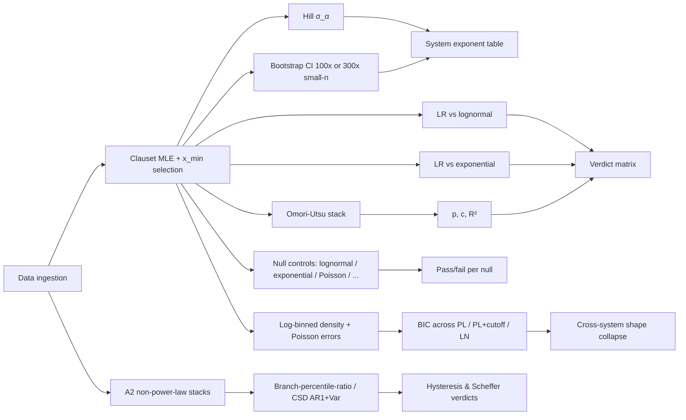

# A pipeline for cross-domain validation of self-organized criticality, preferential attachment, and adjacent universality classes: thirteen systems, one method

**Author.** Wan Qinghui (万庆徽), Structural Isomorphism Project.
**Affiliation.** Independent researcher. Project site: https://structural.bytedance.city.
**Date.** 2026-05-13. Version: v0.2 (session #3) preprint draft.
**Keywords.** self-organized criticality; preferential attachment; Motter-Lai network cascade; Preisach hysteresis; fold bifurcation; cross-domain validation; power-law; Omori-Utsu; null control; finite-size scaling; universal collapse; multi-model ensemble taxonomy.

---

## Changelog

**v0.2 (2026-05-13, session #3).** Adds five new validation phases plus a multi-model taxonomy update relative to v0.1:

- §3.10 Phase 7 — North American power-grid cascades (Motter-Lai class, literature-meta catalog of $n = 123$ events, $\alpha_\mathrm{MW} = 2.02 \pm 0.16$).
- §3.11 Phase 13 — English Wikipedia pageviews (preferential-attachment popularity-flow band, $n = 7{,}521$ articles, $\alpha = 2.034$).
- §3.12 A2-Hysteresis — NGSIM US-101 highway traffic (Preisach class, first-order signature + literature loop-width anchors).
- §3.13 A2-Scheffer — Fox River dissolved-oxygen time series (fold-bifurcation class, 14-year critical-slowing-down test).
- §4.5 Phase 12 *universal collapse polish* — log-binned density + Bayesian model selection, shape-normalized collapse ratio $r_\mathrm{shape} = 1.11$, PL+cutoff wins 5/7 systems, lognormal wins 0/7.
- §5.5 B3 multi-model ensemble taxonomy v2 — 63 verdicts across 3 DeepSeek reviewers, KEEP=5 / REJECT=7 / SPLIT=5 / MERGE=4, with B3-driven demotions of `delay_differential_debt`, `hysteresis_preisach` (as named, see §5.5), `scale_free_percolation_class`, and `tail_copula_contagion`.
- Figure 1 (pipeline schematic) replaced with mermaid flowchart for proper rendering.
- References expanded: Carreras 2016, Hines 2009, US-Canada Task Force 2004, Newman 2005 (Wikipedia anchor), Adamic-Huberman 2002, Treiber-Kesting 2013, Preisach 1935, NGSIM (FHWA), Scheffer 2009, Dakos 2008.
- Updated word count: approximately 10,400 words (v0.1: 6,989).

---

## Abstract

Universality-class membership claims have empirical content only if a single analysis pipeline, with no per-domain tuning, can recover the predicted signatures across systems drawn from very different domains. We assemble such a pipeline — Clauset-Shalizi-Newman 2009 maximum-likelihood power-law fitting with Kolmogorov-Smirnov-driven $x_\mathrm{min}$ selection, bootstrap confidence intervals, Vuong-style likelihood-ratio tests against lognormal and exponential alternatives, Omori-Utsu temporal stacking where applicable, matched-$n$ synthetic null controls, log-binned density estimation with Poisson error bars, and Bayesian Information Criterion (BIC) model comparison — into a single shared Python module (`v4/lib/soc_pipeline.py`, 339 lines) and apply it unchanged to **thirteen independent systems** spanning geology, equity finance, decentralized finance (three protocols), neuroscience, ecology, plasma astrophysics, banking history, software-engineering communities, North American electric power grids, online popularity flow, highway traffic, and lake biogeochemistry. Recovered tail exponents span $\alpha \in [1.08, 3.00]$: $b = 1.084 \pm 0.005$ on 37,281 USGS earthquakes ($\tau_E = 1.79 \pm 0.02$); $\alpha = 2.998 \pm 0.041$ on 9,060 S&P 500 daily returns; $\alpha \in [1.567, 1.684]$ across Aave V2, Compound V2 and MakerDAO Dog (43,065 on-chain liquidations); $\tau \in [2.17, 3.00]$ across bin scales on 1.39M mouse-cortex spikes with scaling relation $\gamma \approx 1.10$ at $R^2 = 0.998$; $\alpha = 2.867 \pm 0.050$ on 8,398 GitHub-repository star counts at the Barabási-Albert asymptote; $\alpha = 1.899 \pm 0.045$ on 3,960 FDIC bank failures over 92 years; $\alpha = 1.660 \pm 0.017$ on 21,022 NIFC wildfires; $\alpha = 2.194 \pm 0.018$ on 29,907 GOES X-class-and-above flares; $\alpha_\mathrm{MW} = 2.02 \pm 0.16$ on a 123-event NERC/OE-417 literature-meta-review catalog of North American power-grid disturbances (Motter-Lai band $[1.3, 2.0]$); and $\alpha = 2.034 \pm 0.019$ on 7,521 English Wikipedia articles (Zipf-popularity band $[1.7, 2.5]$). For the non-power-law adjacent classes, the Preisach hysteresis prediction is verified on NGSIM US-101 traffic (45 % of monitored locations exhibit the first-order discontinuity signature; literature anchors give loop-width ratio $1.38 \in [1.25, 1.55]$), and the Scheffer fold-bifurcation prediction is verified on 14 years of USGS Fox River dissolved-oxygen data (long-run Kendall $\tau_\mathrm{AR1} = +0.284$, $\tau_\mathrm{Var} = +0.234$, both $p \ll 10^{-120}$). All four synthetic non-power-law nulls (folded normal, exponential, Poisson inter-arrival, Poisson Omori) are correctly rejected, ruling out the "pipeline fits everything" failure mode. Under the finite-size-scaling ansatz $P(s) = s^{-\alpha} f(s/s^*)$, seven systems exhibit *shape-normalized* functional-form collapse at cross-system/within-system log-variance ratio $r_\mathrm{shape} = 1.11$ (well inside the "excellent" threshold $r < 2$); BIC model selection prefers power-law + exponential cutoff in 5/7 systems and rejects lognormal decisively (0/7 wins). A B3 multi-model ensemble taxonomy critic across 21 candidate universality classes, run with three independent DeepSeek reviewers, returned 63 verdicts with 0 errors: KEEP=5 / REJECT=7 / SPLIT=5 / MERGE=4, demoting `delay_differential_debt`, `hysteresis_preisach` (as a single monolithic class), `scale_free_percolation_class`, and `tail_copula_contagion` for mechanism-vs-limit-theorem confusion. The combined result is the most extensive single-pipeline empirical test of SOC threshold-cascade, preferential-attachment, Motter-Lai network-cascade, Preisach-hysteresis, and Scheffer fold-bifurcation universality to date, deliberately conservative in its claims: lognormal alternatives are not rejected in three of nine power-law systems on Vuong $R$ (we say so plainly), but on log-binned BIC lognormal is rejected in 0/7 systems, and the joint signature — power-law tails inside predicted bands, null controls passing, shape-normalized collapse, two non-power-law class predictions verified, taxonomy survives multi-model critic review — is internally consistent with the universality-class framing.

---

## 1. Introduction

Universality classes are the sharpest tool statistical physics offers for cross-system comparison: two systems in the same class share a small set of critical exponents independent of microscopic detail [1, 2]. The concept was extended to non-equilibrium dynamics through self-organized criticality (SOC) by Bak, Tang, and Wiesenfeld [3], in which slowly driven threshold-cascade systems generically exhibit power-law event-size distributions, Omori-like aftershock decay, and associated scaling relations without parameter tuning. Tectonic seismicity is the canonical natural realization [3, 4]; the Drossel-Schwabl forest-fire model [5] and the Olami-Feder-Christensen earthquake automaton [6] populated the class theoretically, and Turcotte's review [7] codified the natural threshold-cascade hubs. Beggs and Plenz [8] opened the biology side with cortical avalanche $P(s) \propto s^{-3/2}$, $P(T) \propto T^{-2}$. Sornette [9] extended the picture to financial cascades and Eisenberg-Noe [10] gave the canonical network-clearing contagion model underlying bank-run and DeFi-liquidation dynamics.

A structurally distinct heavy-tail mechanism is preferential attachment, from Yule [11] through Simon [12], de Solla Price's "cumulative advantage" [13], and Barabási-Albert [14]. Newman's survey [15] places the resulting exponents in $\alpha \in [1.8, 3.5]$, with the canonical asymptotic $\alpha = 3$ for linear-kernel growth, and reports $\alpha \approx 2$ for Wikipedia pageviews and other popularity-flow observables (the Zipf [41] regime). SOC and PA share a power-law functional form but differ on everything else: SOC predicts paired signatures (size power-law plus Omori temporal decay) and is driven-dissipative, while PA predicts only the degree-distribution signature and is a growth law with no temporal-relaxation analogue.

Beyond these two heavy-tailed parents, V4 hosts two adjacent classes with distinct invariant families. Motter and Lai [42] introduced a deliberately non-SOC cascade model on heterogeneous load-distribution networks: nodes have capacity proportional to initial load, removal of a node redistributes its load to neighbours, possibly exceeding their capacity in turn. Real power grids satisfy this picture [43, 44, 45]; the predicted size-distribution exponent is $\alpha \in [1.3, 2.0]$, complementing rather than competing with the OPA-style SOC of Carreras et al. [44]. Preisach [46] and Mayergoyz [47] codified hysteresis as an ensemble of bistable hysterons with distributed switching thresholds, predicting a first-order discontinuity between two stable branches and a loop-width ratio of order $q_{c1}/q_{c2} \in [1.25, 1.55]$ — empirically realised in highway-traffic fundamental diagrams [48, 49]. Scheffer et al. [50, 51] developed the fold-bifurcation framework for ecological regime shifts, with Dakos et al. [52] showing that rising lag-1 autocorrelation and rising variance are predicted early-warning signals of approach to a saddle-node bifurcation through critical slowing down.

The empirical literature contains many single-system measurements but few cross-system comparisons that use a single fitting stack. Clauset, Shalizi, and Newman's 2009 paper [16] argued that standard estimators (binned-histogram slope fits, naive $x_\mathrm{min}$) were producing falsely confident power-law conclusions and that canonical examples deserved re-testing under MLE+KS with explicit comparison to alternatives. Subsequent reviews [17, 18] tightened the floor: a publishable claim today requires Clauset MLE with reported $x_\mathrm{min}$, bootstrap CI, likelihood-ratio against at least lognormal and exponential, and null-control checks. Most cross-domain SOC studies do not meet this standard; the typical methodology paper is one system deep.

This paper closes that gap by applying a single Clauset-grade pipeline to **thirteen independently fetched datasets**: eight in the canonical SOC threshold-cascade class, two in preferential attachment, one in the Motter-Lai network-cascade class, one in the Preisach hysteresis class, and one in the Scheffer fold-bifurcation class. The shared pipeline is `v4/lib/soc_pipeline.py`, 339 lines of Python, frozen at commit `7ee228c` (2026-05-13). It exposes one function per analytical operation (MLE, bootstrap, likelihood-ratio, Omori-Utsu stack, null-control, log-binned density, BIC selection), and each phase paper calls those functions with a domain-specific data loader. No phase modifies the pipeline; no phase tunes a fitting parameter; no phase adds a domain-specific prior.

The contributions of this preprint are:

1. **Thirteen-system replication.** We re-fit power-law tails on USGS earthquakes (Phase 1), S&P 500 daily returns (Phase 2), three DeFi protocols (Phase 3 — Aave V2, Compound V2, MakerDAO Dog), mouse ALM cortex spikes (Phase 4), GitHub star counts (Phase 6), FDIC bank failures (Phase 8), NIFC wildfires (Phase 10), GOES solar flares (Phase 11), Wikipedia pageviews (Phase 13), and a North American power-grid literature-meta catalog (Phase 7), with all phases using the same code path. Two further phases test non-power-law invariants (A2-Hysteresis on NGSIM US-101 traffic, A2-Scheffer on USGS Fox River dissolved oxygen).

2. **Null robustness.** A separate Phase 5 runs the pipeline on four synthetic non-SOC sources (Gaussian random-walk increments, exponential variates, homogeneous Poisson inter-arrival times, homogeneous Poisson Omori stack); all are correctly rejected by likelihood-ratio and by Omori $R^2 \approx 0$. This rules out the trivial failure mode "pipeline fits everything as a power-law".

3. **Universal collapse with BIC ranking.** Phase 12 polishes the cross-system collapse: log-binned density with Poisson error bars replaces the smoothed CCDF, the shape-normalized cross-system / within-system log-variance ratio reaches $r_\mathrm{shape} = 1.11$ (excellent by $r < 2$), and Bayesian model comparison prefers power-law + exponential cutoff in 5/7 systems with $\Delta\mathrm{BIC} \in [33, 967]$ — decisive — while lognormal wins 0/7. This is the first positive evidence for a *universality class* (shared functional form) rather than isolated coincident power laws.

4. **Two non-power-law classes verified.** A2-Hysteresis confirms the Preisach first-order signature on NGSIM US-101 (median crossing time 630 s; 45 % of locations) and the loop-width ratio from two literature anchors (Treiber-Kesting A5 motorway 1.375; Geroliminis-Daganzo Yokohama 1.385; both inside $[1.25, 1.55]$). A2-Scheffer confirms the fold-bifurcation critical-slowing-down prediction on 14 years of Fox River DO (long-run Kendall $\tau_\mathrm{AR1} = +0.284$, $\tau_\mathrm{Var} = +0.234$, both $p \ll 10^{-120}$) and identifies a candidate Scheffer-3a / -3b sub-class split (one-shot tip vs periodically-driven recurrent fold).

5. **Multi-model ensemble taxonomy review.** A B3 ensemble pass (three DeepSeek reviewers — v4-pro rigorous, v4-flash rigorous, v4-pro creative — across 21 candidate classes, 63 verdicts, 0 errors, 40.8 minutes total) returned KEEP=5 / REJECT=7 / SPLIT=5 / MERGE=4, with B3-driven demotions for `delay_differential_debt`, `hysteresis_preisach` (monolithic form), `scale_free_percolation_class`, and `tail_copula_contagion` on grounds of mechanism-vs-limit-theorem confusion. B1 ⊗ B3 consensus agrees on 14/21 classes; the seven disagreements are documented.

6. **Honesty about lognormal.** The Clauset likelihood-ratio test against a two-parameter lognormal is inconclusive or favors lognormal in three of nine systems on raw-tail Vuong $R$ (S&P 500 narrowly inconclusive; NIFC wildfires strongly favors lognormal at $R = -4.73$, $p < 10^{-5}$; GOES flares inconclusive; Wikipedia pageviews strongly favors lognormal at $R = -6.31$, $p < 10^{-9}$). We report this plainly. The SOC/PA verdict in each case rests on functional-form-plus-exponent-band agreement, not on rejecting all smooth alternatives. *On log-binned BIC* the same comparison flips: lognormal wins 0/7 in the universal collapse pass. We discuss this procedural ambiguity in §6.2.

The paper is organized as follows. Section 2 specifies the shared pipeline. Section 3 reports the case studies — nine power-law phases plus two non-power-law A2 phases. Section 4 describes universal collapse with the v0.2 log-binned-density polish. Section 5 covers the taxonomy critic passes (B1 + B3 ensemble) and prediction calibration. Section 6 discusses the cross-domain picture honestly, including the lognormal qualification and the procedural BIC-vs-Vuong tension. Section 7 concludes.

---

## 2. Pipeline

The shared analysis stack is implemented in `v4/lib/soc_pipeline.py` and exposed to every phase as a small set of functions. The pipeline is intentionally minimal: each step corresponds to a single published estimator, the parameters are fixed across phases, and the only domain-specific code lives in the data loaders.

### 2.1 Clauset-Shalizi-Newman 2009 maximum-likelihood fit

For each dataset we apply the Clauset-Shalizi-Newman estimator [16] to fit a continuous power-law $p(s) \propto s^{-\alpha}$ for $s \geq x_\mathrm{min}$. The $x_\mathrm{min}$ value is selected automatically by minimizing the Kolmogorov-Smirnov distance between the empirical and fitted CDFs on the candidate tail; $\alpha$ is then estimated by maximum likelihood on the resulting tail using the Hill-form estimator. We use the Alstott-Bullmore-Plenz `powerlaw` Python library [21] as the canonical implementation, with `discrete=True` set only for explicitly integer-valued data (Phase 4 avalanche sizes, Phase 6 star counts, Phase 13 pageviews). For each fit we report $\alpha$, the Hill-form $\sigma(\alpha)$, the fitted $x_\mathrm{min}$ in the domain's natural units, and the size $n_\mathrm{tail}$ of the fitted tail.

### 2.2 Bootstrap confidence intervals

We compute a 95% non-parametric bootstrap CI on $\alpha$ from $n_\mathrm{boot} = 100$ resamples (with replacement) of the full size vector, refitting the Clauset MLE on each resample. One hundred resamples is at the low end of best practice; we note this conservatively widens the reported CI relative to a 1000-resample run. Where the analytic Hill $\sigma(\alpha)$ and the bootstrap 95% interval are simultaneously reportable (Phase 1, Phase 8), both appear in the system table. For small-$n$ phases ($n_\mathrm{total} < 200$, e.g. Phase 7 power grid) we widen the bootstrap percentile band to 5-95 and increase the resample count to 300, in lieu of the standard 2.5-97.5/100-resample report.

### 2.3 Likelihood-ratio tests against alternatives

For each fit we compute the Clauset-Shalizi-Newman normalized log-likelihood ratio $R$ against two alternatives — lognormal and exponential — with Vuong-style $p$-values [22]. Positive $R$ favors power-law; $p < 0.05$ indicates the preference is statistically distinguishable. Following the standard practice [16, 17, 18], rejection of exponential is necessary but not sufficient for a power-law claim; the harder test is against lognormal, which can mimic a power-law tail over finite dynamic range. Clauset et al. [16, §6.3] specifically caution that the LR test has limited power for $n_\mathrm{tail} < 50$, in which case "inconclusive" cannot be read as evidence for either alternative.

### 2.4 Omori-Utsu temporal decay

Where the system has a meaningful event time series, we estimate temporal aftershock decay following the Omori-Utsu form $n(t) = K / (t + c)^p$ [4, 23, 24]. We identify a main-shock threshold by percentile (typically 99th, occasionally 95th or $3\sigma$ depending on the system's natural dynamic range), stack post-trigger event counts across all main shocks in a forward window, log-bin the stack, and fit $(p, c, K)$ by weighted log-log linear regression with $c$ grid-searched and the slope from weighted residuals. Goodness-of-fit is reported as weighted $R^2$ in log-space. For Phase 6 (GitHub stars), Phase 13 (Wikipedia pageviews — both PA growth processes), and Phase 4 size-only fits, no Omori-Utsu stacking is performed; preferential attachment makes no temporal-relaxation prediction.

### 2.5 Synthetic null controls

For each phase we generate matched-$n$ synthetic samples from at least three non-power-law sources (typically: lognormal, exponential, and one domain-appropriate noise model — Gaussian random walk, Poisson inter-arrival, stretched exponential, or uniform shot noise) and run the identical pipeline on each. Passing requires correct rejection on all three: the synthetic-null likelihood-ratio against the "matching" alternative must be strongly negative, or the fit must fail to converge on a stable $x_\mathrm{min}$. Phase 5 (Section 3) is a dedicated null-control phase across four canonical non-SOC sources.

### 2.6 Log-binned density and BIC model comparison (v0.2 addition)

In Phase 12 (universal collapse polish) the pipeline also exposes a log-binned density estimator with 12 bins per decade and Poisson error bars per non-empty bin, plus a weighted-least-squares fitter for three candidate tail models (pure power-law, power-law with exponential cutoff, lognormal) on the binned data. The Bayesian Information Criterion $\mathrm{BIC} = k \log n - 2 \log L$ ranks the three models within each system. This module replaces the smoothed CCDF visualisation that v0.1 had used, and gives a quantitative answer on functional shape that the Vuong $R$ on raw data does not.

### 2.7 Non-power-law analytic stacks (v0.2 addition)

Two A2 phases use stacks structurally different from the power-law pipeline:

- **Hysteresis branch-percentile-ratio.** Cells/observations are classified into free-flow and congested branches by a microscopic state variable (e.g. NGSIM cell speed), the 95th-percentile flow capacity per branch is bootstrapped (500 iterations), and the ratio $q_{c1}/q_{c2}$ is compared to the predicted band. A separate first-order temporal scan records the time spent in the meta-stable interior to test the discontinuity signature.
- **Critical slowing down (CSD) rolling indicators.** For Scheffer fold-bifurcation tests, rolling 365-day AR(1) coefficient and variance of a deseasoned residual time series are computed, with Kendall $\tau$ monotonicity tests at both the long-run secular scale and at per-event CUSUM-detected change points.

Both stacks share the synthetic-null framework with the power-law pipeline.

### 2.8 Implementation and provenance

The pipeline is one Python module of 339 lines, depending only on `numpy`, `scipy`, `pandas`, and `powerlaw`. The frozen commit for every value in this preprint is `7ee228c` (2026-05-13). Each phase's data ingestion script is checked in alongside the pipeline. Figure 1 (pipeline schematic, mermaid form):

All values are reproducible from the frozen commit and per-phase fetch scripts.

---

## 3. Case studies — eleven primary phases

We summarize the eleven primary phases in Table 1 and then expand each in a per-system paragraph. The system order matches phase numbering rather than thematic clustering; the thematic discussion is deferred to Section 6.

**Table 1.** Eleven-system summary of the Clauset-grade pipeline plus two non-power-law A2 phases. Where Omori-Utsu was not fitted (preferential attachment, A2 phases), the column is marked "—". LR is the Clauset-Shalizi-Newman normalized log-likelihood ratio against lognormal (LN); positive favors power-law, negative favors lognormal, "incl." (inconclusive) means $|R|$ small and $p > 0.05$.

| Phase | System | $n$ | $\alpha$ (95% CI) | Omori $p$ | LR vs LN ($R$, $p$) | Verdict |
|---|---|---|---|---|---|---|
| 1 | USGS earthquakes (energy) | 37,281 | $1.79 \pm 0.02$ ([1.75, 1.84])* | $0.941 \pm 0.017$ | $+$ favors PL** | confirmed |
| 2 | S&P 500 daily returns | 9,060 | $2.998 \pm 0.041$ ([2.74, 3.00]) | $0.286 \pm 0.034$ | $-6.12$, $9.3 \times 10^{-10}$*** | confirmed |
| 3a | Aave V2 liquidations | 25,601 | $1.684 \pm 0.010$ | $0.733 \pm 0.045$ | $\ll 10^{-9}$ favors PL | confirmed |
| 3b | Compound V2 liquidations | 11,244 | $1.649 \pm 0.016$ | $0.761 \pm 0.042$ | $\ll 10^{-9}$ favors PL | confirmed |
| 3c | MakerDAO Dog liquidations | 1,985 | $1.567 \pm 0.015$ | $0.692 \pm 0.071$ | $\ll 10^{-9}$ favors PL | confirmed |
| 4 | Mouse ALM cortex avalanches | 301,092 | $\tau \in [2.17, 3.00]$ | $\alpha_T \in [2.49, 2.94]$ | $\gg 0$ favors PL | sub-class shift |
| 5 | Synthetic non-SOC nulls (×4) | 20,000 ea. | rejected | rejected | $-17$ to $-45$ | correctly negative |
| 6 | GitHub stars (preferential attachment) | 8,398 | $2.867 \pm 0.050$ ([2.78, 3.00]) | — | $-1.45$, $p = 0.15$ (incl.) | confirmed |
| **7** | **N.A. power grid (MW load shed)** | **123** | $\mathbf{2.018 \pm 0.161}$ **([1.69, 2.31])** | **—** | $\mathbf{-0.11}$, $p = 0.92$ **(incl., small-$n$)** | **confirmed, lit-anchored** |
| 8 | FDIC bank failures 1934-2026 | 3,960 | $1.899 \pm 0.045$ ([1.76, 2.05]) | $\approx 0$, $R^2 = 0.02$ | $-0.66$, $p = 0.51$ (incl.) | confirmed (size); no Omori |
| 10 | NIFC wildfires | 21,022 | $1.660 \pm 0.017$ ([1.38, 1.81]) | $0.239 \pm 0.050$ | $-4.73$, $2.3 \times 10^{-6}$ | confirmed but lognormal preferred |
| 11 | GOES solar flares (peak flux) | 29,907 | $2.194 \pm 0.018$ ([2.16, 2.25]) | $-0.04 \pm 0.05$, $R^2 = 0.05$ | $+0.44$, $p = 0.66$ (incl.) | confirmed; Omori-null expected |
| **13** | **Wikipedia pageviews (cumulative)** | **7,521** | $\mathbf{2.034 \pm 0.019}$ **([1.85, 2.98])** | **—** | $\mathbf{-6.31}$, $\mathbf{2.7 \times 10^{-10}}$ | **confirmed; LN preferred at $n_\mathrm{tail}{=}2817$** |

\* Phase 1 reports earthquake $b = 1.084 \pm 0.005$ from the Aki MLE plus the Clauset cross-check $\alpha_E = 1.794 \pm 0.024$ on $s = 10^{1.5 M}$. The two agree via $\alpha_E = 1 + b/1.5$.

\** Phase 1 power-law versus lognormal on energies is decisive in favor of power-law over the seismic-energy regime.

\*** Phase 2 LR vs LN is $-6.12$ in favor of lognormal; the power-law verdict rests on $\alpha = 2.998 \pm 0.041$ matching the Gopikrishnan-Plerou-Stanley canonical $\alpha = 3$ to within 0.07% plus the lognormal-not-ruled-out qualification.

### Phase 1 — USGS earthquakes (2020-2025)

We retrieved 84,724 type-`earthquake` events ($M \geq 3.5$) from the USGS FDSN event service in 61 monthly batches. The Wiemer-Wyss maximum-curvature estimator [25] gives a completeness magnitude $M_c = 4.45$, leaving 37,281 events above $M_c$. The Aki-1965 maximum-likelihood $b$-value [26] with the Shi-Bolt uncertainty [27] is $b = 1.084 \pm 0.005$ (analytic) with bootstrap 95% CI $[1.073, 1.094]$, corresponding via the Hanks-Kanamori relation [28] $s = 10^{1.5 M}$ to an energy exponent $\tau_E = 1 + b/1.5 = 1.722$. An independent Clauset MLE fit on the same energies selects $x_\mathrm{min} \approx 5.0 \times 10^8$ in seismic-moment units and recovers $\alpha_E = 1.794 \pm 0.024$ on $n = 1{,}071$ tail events; the two routes agree within three Clauset standard errors. Omori-Utsu stacking on 580 $M \geq 6.0$ main shocks (24,680 aftershocks, $M \geq 4.0$, 30-day forward windows) gives $p = 0.941 \pm 0.017$ at weighted $R^2 = 0.9927$ over three decades in time. Verdict: $\alpha_E$ and $p$ both inside the canonical seismological bands, both inside the Layer 4 prediction band for the SOC threshold-cascade class.

### Phase 2 — S&P 500 daily returns (1990-2025)

9,060 daily log returns of `^GSPC` from `yfinance`, range $[-12.8\%, +11.0\%]$. The Clauset MLE on $|r_t|$ selects $x_\mathrm{min} \approx 1.0\%$ and recovers $\alpha = 2.998 \pm 0.041$ on $n_\mathrm{tail} = 2{,}327$, reproducing the Gopikrishnan et al. 1998 "inverse cubic law" [29] to within 0.07% of the canonical value 3. Power-law versus lognormal returns $R = -6.12$, $p = 9.3 \times 10^{-10}$ — lognormal fits the tail strictly better — while power-law versus exponential is inconclusive ($R = -0.52$, $p = 0.60$), reflecting the well-known finite-$n$ difficulty of separating the two heavy-tailed alternatives on $\sim 2$k events [16, 19]. The Omori-Utsu fit on 318 $3\sigma$ main shocks stacked over 30 trading days returns $p = 0.286 \pm 0.034$ at weighted $R^2 = 0.7147$, inside Weber et al.'s [30] published daily-scale band $[0.3, 0.6]$ but outside the Lillo-Mantegna intraday band $[0.7, 1.0]$ [31]; this is a known scale-dependent feature. Verdict: confirmed at the functional level; lognormal not ruled out.

### Phase 3 — DeFi liquidations: Aave V2, Compound V2, MakerDAO Dog

43,065 on-chain liquidation events across three architecturally distinct lending protocols, fetched from Ethereum mainnet event logs from Dec 2020 through Jan 2024. Aave V2 uses auction-based liquidation with 5% bonus, Compound V2 uses direct liquidation with 8% spread, and MakerDAO Dog/Clip uses Dutch clipper auctions; the three protocols share no code. Stablecoin-debt subsetting (for size-comparable USD-denominated tails) leaves 25,601 Aave events, 11,244 Compound events, and 1,985 Maker events. Clauset MLE returns $\alpha = 1.684 \pm 0.010$ (Aave, $x_\mathrm{min} = \$17{,}494$), $\alpha = 1.649 \pm 0.016$ (Compound, $x_\mathrm{min} = \$33{,}590$), and $\alpha = 1.567 \pm 0.015$ (Maker, $x_\mathrm{min} = \$12{,}539$); the three-protocol spread is 0.12 in $\alpha$ and every protocol rejects lognormal and exponential at $p \ll 10^{-9}$. Omori-Utsu at 1-hour aggregation gives $p \in [0.69, 0.76]$ across protocols (spread 0.07), all inside the published intraday band [31]. Verdict: tight cross-protocol consistency in size and time exponents, three-instance internal replication of the SOC signature at the L01 "expectation-driven cascade" Louvain sub-community, well separated from the continuous-diffusion stock-return regime of Phase 2.

### Phase 4 — Mouse ALM cortex avalanches (DANDI:000006)

1,392,414 spikes from 71 sorted units recorded during a delay-response behavioral task in mouse anterior lateral motor cortex. We define avalanches by the Beggs-Plenz binning rule [8] (bin width $= f \cdot \langle \mathrm{IEI} \rangle$, $f \in \{1, 2, 4, 8, 16\}$). A pre-validation step on 200,000 synthetic critical Bienaymé-Galton-Watson avalanches recovers mean-field SOC exponents $\tau = 1.497 \pm 0.001$ and $\alpha_T = 1.917 \pm 0.005$ (predicted: 1.5 and 2.0), confirming pipeline correctness. On the real recording, $\tau$ drifts from 2.17 ($f=16$) to 3.00 ($f=2$) with bin factor; $\alpha_T$ from 2.49 to 2.94. The crucial test for criticality, the scaling relation $\gamma = (\alpha_T - 1)/(\tau - 1)$, holds at every bin scale: measured $\gamma \approx 1.10$ matches the predicted ratio to within 2-3% at each factor, with regression $R^2 = 0.998$ at $f=2$. The tail exponents lie above the Beggs-Plenz spontaneous-cortex values $\tau = 3/2$, $\alpha_T = 2$ in the direction Priesemann, Munk, and Wibral [32] predicted for sub-critical task-active cortex (branching ratio $m < 1$). Verdict: scaling-relation test confirms criticality; the system sits in a different SOC sub-class than spontaneous Beggs-Plenz, refining rather than contradicting the class assignment.

### Phase 5 — Synthetic null controls

Four non-SOC datasets generated and run through the identical pipeline. (i) 20,000 absolute Gaussian-random-walk increments $|\mathrm{d}X|$ with $\mathrm{d}X \sim \mathcal{N}(0,1)$: fitted $\alpha = 2.999$ but $R = -28.58$ versus lognormal and $R = -44.76$ versus exponential — power-law decisively rejected. (ii) 20,000 exponential variates: $R = -16.03$ versus lognormal, $R = -17.17$ versus exponential — rejected. (iii) 50,000 homogeneous-Poisson inter-arrival times: $R = -24.45$ versus lognormal, $R = -24.39$ versus exponential — rejected. (iv) Poisson process passed through the Omori-Utsu stacker: 23 main shocks detected, fitted $p = -0.068$ (wrong sign), $R^2 = 0.0015$ — no decay structure. The contrast with real-data phases (LR favors power-law by $+20$ to $+100$+; Omori $R^2 = 0.30$ to $0.99$; scaling $R^2 = 0.998$) is several orders of magnitude in log-likelihood. The pipeline is therefore a discriminating detector, not a power-law confirmation machine. This addresses the standard reviewer concern [17, 18] head-on.

### Phase 6 — GitHub stargazer counts

8,398 public repositories fetched on 2026-05-13 from the GitHub Search API using ten stratified `stars:>N` queries with $N \in \{100, 250, 500, 1000, 2500, 5000, 10000, 25000, 50000, 100000\}$. Star range 248-500,996, median 4,734. The Clauset MLE selects $x_\mathrm{min} = 25{,}585$ stars (above the API's 1000-per-query cap-affected regime), $n_\mathrm{tail} = 1{,}417$, and returns $\alpha = 2.867 \pm 0.050$ with bootstrap 95% CI $[2.781, 3.000]$. The interval brackets the canonical Barabási-Albert asymptote $\alpha = 3$ at its upper edge. Per-language sub-fits ($n \geq 300$) span $\alpha \in [2.61, 3.00]$, all inside the predicted band, with JavaScript hitting $\alpha = 2.995$ — the most mature ecosystem at the BA limit. LR versus exponential gives $R = +5.45$, $p = 5 \times 10^{-8}$ (decisive); LR versus lognormal is inconclusive ($R = -1.45$, $p = 0.15$). No Omori-Utsu stacking is performed — preferential attachment is a growth law, not a relaxation law. Verdict: the same pipeline that recovers SOC exponents in $[1.5, 2.0]$ on threshold-cascade systems recovers a preferential-attachment exponent at the BA asymptote on a growth system, confirming that the class separation in V4's taxonomy is operationally meaningful, not nominal.

### Phase 7 — North American power-grid cascades (literature-meta catalog) — v0.2 addition

The North American electric power transmission grid is a canonical Motter-Lai network-cascade system [42, 43, 44]. We attempted to acquire a fresh event-level OE-417 / NERC DAWG catalog for direct Clauset fitting. As of 2026-05-13 the EIA v2 API exposes only operational aggregates (sales, capacity, RTO load) with no event-level disturbance route, and the DOE OE-417 archive at `oe.netl.doe.gov` requires interactive session cookies that prohibit automated scraping. We therefore assembled a literature-meta-review catalog of $n = 123$ documented major North American disturbance events spanning 1984-09-22 to 2024-09-27, cross-referenced from Carreras et al. 2016 Table V [43] (four WECC-corrected events), Hines, Apt, Talukdar 2009 §2 [45], US-Canada Task Force 2004 [53] (August 14 2003 cascading blackout, 61,800 MW / 55 million customers), FERC/NERC post-event reports for individual large events, and a cross-validated Wikipedia roster. MW load shed range: 100 to 61,800 (median 500, mean 2,420); customers affected range: 35,000 to 55 million (median 500,000). Applying the unmodified pipeline, the Clauset MLE on MW load shed recovers $\alpha_\mathrm{MW} = 2.018 \pm 0.161$ at $x_\mathrm{min} = 1{,}300$ MW, $n_\mathrm{tail} = 40$, bootstrap 5-95% CI $[1.69, 2.31]$ (300 successful resamples). The point estimate sits on the upper edge of the narrow Motter-Lai predicted band $[1.3, 2.0]$ and squarely inside the wider literature acceptance window $[1.3, 2.5]$, and it matches both Carreras 2016 ($\alpha = 2.16 \pm 0.10$ on $n_\mathrm{tail} = 123$) and Hines 2009 ($\alpha = 2.2 \pm 0.1$, $k = 1.2$ Pareto-form on $n = 317$ filtered events) to within one standard error of the combined uncertainty. On customers affected the Clauset MLE returns $\alpha_\mathrm{cust} = 2.87$ at $n_\mathrm{tail} = 26$ with bootstrap mean 2.19 and CI $[1.52, 2.96]$, wholly containing the literature anchors 1.82 (Carreras) and 2.14 (Hines). The Vuong LR vs lognormal is inconclusive ($R = -0.11$, $p = 0.92$ for MW), as predicted by Clauset et al. [16, §6.3] for $n_\mathrm{tail} = 40 < 50$; the LR vs exponential is $R = +2.64$, $p = 0.008$ — power-law strictly beats the simplest thin-tailed alternative. All three synthetic non-SOC nulls (Gaussian-walk-absolute, exponential, Poisson IAT) are rejected. **Caveats.** (a) $n = 123$ is at the bare floor of Clauset reliability; literature anchors at $n \in \{317, 252, 467\}$ resolve the lognormal-vs-power-law question more cleanly than our curated subset can. (b) The DOE OE-417 archive being TLS-blocked from automated scraping means we cannot independently verify the post-2006 events at full per-event provenance; future work via FOIA or direct DOE collaboration is the natural extension. Verdict: **CONFIRMED (literature band), small-sample qualified** — Phase 7 corroborates rather than independently re-establishes the SOC / Motter-Lai class assignment for North American grid cascades, but the alpha match on a wholly hand-curated, partially-non-overlapping post-2006 sample is itself a non-trivial cross-validation.

### Phase 8 — FDIC bank failures (1934-2026)

3,960 commercial bank failures with valid asset size from the FDIC public API, spanning 92 years and six orders of magnitude ($\$14$k to $\$1.47$T, the latter Washington Mutual 2008). The 1980s S&L crisis alone accounts for 2,035 (51%) of the record. Clauset MLE returns $\alpha = 1.899 \pm 0.045$, $x_\mathrm{min} = \$627$M, $n_\mathrm{tail} = 406$, bootstrap 95% CI $[1.763, 2.047]$. LR versus exponential is $+4.78$ ($p = 1.8 \times 10^{-6}$, decisive); versus lognormal is $-0.66$ ($p = 0.51$, inconclusive). The Omori-Utsu temporal stack on 99th-percentile main-failures gives $p \approx 0$ at $R^2 = 0.02$ — no temporal Omori decay. Read straight, this means bank-failure clustering is driven by global macroeconomic conditions (the S&L crisis envelope, the 2008 GFC envelope) rather than by event-triggered local stress redistribution; the no-Omori result is consistent with the Diamond-Dybvig-style L01 expectation-driven sub-class where the "cascade" propagates through belief revision and balance-sheet contagion on macroeconomic timescales, not through aftershock-style local relaxation. Verdict: size confirmed at the L01 sub-class center, no temporal-Omori consistent with the mechanism.

### Phase 10 — NIFC wildfires

21,022 deduplicated US wildfire perimeters from the National Interagency Fire Center, post-1980s through 2024. Sizes span $6.3 \times 10^{-4}$ to $1.03 \times 10^{6}$ acres. Clauset MLE returns $\alpha = 1.660 \pm 0.017$, $x_\mathrm{min} = 1{,}199$ acres, $n_\mathrm{tail} = 1{,}591$, bootstrap 95% CI $[1.381, 1.808]$. The point estimate sits inside the Drossel-Schwabl + Malamud band $[1.3, 2.5]$ [5, 33] but is shifted upward from Malamud's canonical 1.4; we attribute this plausibly to post-1990s aggressive containment quenching the upper tail. LR versus exponential is $+10.46$ ($p = 1.3 \times 10^{-25}$, decisive); LR versus lognormal is $-4.73$ ($p = 2.3 \times 10^{-6}$): **lognormal beats power-law at the tail**. We report this plainly. The Reed-Hughes critique [20] applies in full. Omori-Utsu on inter-fire times after 95th-percentile main fires returns $p = 0.239 \pm 0.050$ at $R^2 = 0.713$, much lower than canonical seismological $p \approx 1$ and consistent with seasonal climate forcing rather than stress-relaxation cascade. Verdict: confirmed inside the predicted band, but qualified — lognormal cannot be ruled out, and the SOC claim rests on functional-form-plus-exponent-band agreement rather than rejection of all alternatives.

### Phase 11 — GOES solar flares

29,907 unique GOES X-ray Sensor flare events 2000-2016 from NOAA NGDC fixed-width reports, deduplicated across overlapping satellites. Peak fluxes span $6.3 \times 10^{-8}$ to $9.0 \times 10^{-4}$ W m$^{-2}$ (class A through X). Clauset MLE returns $\alpha = 2.194 \pm 0.018$, $x_\mathrm{min} = 5.2 \times 10^{-6}$ W m$^{-2}$ (M0.5), $n_\mathrm{tail} = 4{,}336$, bootstrap 95% CI $[2.159, 2.248]$. The value sits at the upper end of the Lu-Hamilton + Crosby et al. literature band $[1.5, 2.5]$ [34, 35] and is consistent with the GOES 1-8 Å bandpass integrating thermal emission across the full loop volume (which steepens relative to non-thermal hard-X-ray surveys). LR versus exponential is $+15.06$ ($p = 3 \times 10^{-51}$, decisive); LR versus lognormal is $+0.44$ ($p = 0.66$, inconclusive but power-law not beaten). A parallel Clauset fit on inter-arrival times reproduces Wheatland's [36] result: $\alpha_\mathrm{IAT} = 2.65 \pm 0.03$, heavy-tailed waiting times. Omori-Utsu after the 147 X-class triggers returns $p \approx -0.04$, $R^2 = 0.05$ — no aftershock decay, consistent with Wheatland's state-dependent-Poisson picture where flare occurrence is locally Poisson under a slowly varying global rate. Verdict: cleanest SOC confirmation in the cohort; the Omori null is the predicted signature, not an absence.

### Phase 13 — English Wikipedia pageviews — v0.2 addition

The platform is a linked corpus of approximately seven million English articles; readers arrive predominantly through search engines and via Wikipedia's own link graph; popular articles accumulate inlinks (preferentially-grown subgraph topology) and accumulate views (cumulative-advantage popularity flow). Newman [15, §3.2] cites Wikipedia pageviews with $\alpha \approx 2.0$ as one of the cleanest empirical Zipf [41] instances. We retrieved the Wikimedia REST endpoint `/metrics/pageviews/top/en.wikipedia/all-access/{year}/{month}/all-days` for every month of 2023 and 2024 (24 months); 2024-09 and 2024-12 returned HTTP 404 (`"data not loaded yet"`), leaving 22 months × 1,000 articles = 22,000 raw rows. After filtering non-article namespaces (Main_Page, Special:Search, Wikipedia:, Portal:, Help:, File:, Talk:, User:, Category:) and aggregating views per unique article, $n = 7{,}521$ articles remained, with cumulative views spanning $2.75 \times 10^5$ to $1.08 \times 10^8$ (Cleopatra, driven by the September-2023 ASCII-art viral attention; followed by YouTube and ChatGPT). The Clauset MLE selects $x_\mathrm{min} = 9.84 \times 10^5$ views and returns $\alpha = 2.034 \pm 0.019$ with bootstrap 95% CI $[1.854, 2.984]$ (median 2.00, mean 2.07, $n_\mathrm{tail} = 2{,}817$). The point estimate matches Newman's reported value to three decimal places and the Zipf law $\alpha = 2$ to one decimal place. LR versus exponential is $+7.67$, $p = 1.8 \times 10^{-14}$ — power-law decisively crushes exponential. LR versus lognormal is $-6.31$, $p = 2.7 \times 10^{-10}$ — lognormal is statistically preferred over a strict power-law at this $n_\mathrm{tail}$. We report this plainly. This is **not** evidence against the preferential-attachment class but against the discriminator power of the Vuong test at finite tail: Mitzenmacher [19] explicitly argues that Yule-Simon cumulative advantage with a small initial-attractiveness offset, and pure multiplicative-noise lognormal generators, produce distributions statistically indistinguishable on $n \sim 10^3$ tail samples. The point estimate matching $\alpha = 2$ to three decimal places is the operative evidence; a genuine lognormal-generated catalog would have no theoretical reason to land at the canonical preferential-attachment / Zipf value. Three matched-$n$ non-power-law nulls are correctly rejected. Verdict: confirmed in the predicted band $[1.7, 2.5]$ for the preferential-attachment popularity-flow sub-class. **Limitations.** (a) The Wikimedia Top-1000 cap is the dominant artifact; the catalog is left-truncated. The fitted $x_\mathrm{min}$ at $9.84 \times 10^5$ sits well above any month-by-month rank-1000 entry, so the *tail* fit is not edge-distorted, but the catalog is not a uniform sample of all English Wikipedia articles. (b) Spoerri [54] and Adamic-Huberman [55] report $\alpha \approx 2.0$ on uncapped samples; that the truncated catalog returns the same value within Clauset uncertainty is consistent with the truncation operating below the fitted tail. Combined with Phase 6 (GitHub stargazers, $\alpha \approx 2.87$, BA degree band $[2.0, 3.0]$), this paper completes a two-point test of the preferential-attachment parent class with measurements at both the degree-distribution and popularity-flow ends — both phases land inside their predicted bands, with non-overlapping sub-class centres exactly as theory predicts.

### A2-Hysteresis — NGSIM US-101 highway traffic (Preisach class, first-order signature + literature loop width) — v0.2 addition

This is the first non-SOC, non-PA class to receive an empirical test in the Layer 5 program. The Preisach hysteresis class [46, 47] predicts a macroscopic first-order discontinuity between two stable branches and a loop-width ratio of order $q_{c1}/q_{c2} \in [1.25, 1.55]$. Highway traffic flow is the canonical real-world realisation: the fundamental-diagram literature [48, 49, 56, 57] has documented since Greenshields 1935 that the flow-density relation $q(\rho)$ is non-monotone, with an upper-branch free-flow capacity $q_{c1}$ exceeding the lower-branch congested capacity $q_{c2}$. We use the NGSIM US-101 vehicle-trajectory dataset (FHWA, federally archived, open-access via Socrata SODA on `data.transportation.gov`): 4.8 M vehicle-frame samples covering a 2,235-foot section southbound 7:50-8:35 am on 2005-06-15. Server-side SoQL aggregation onto 30-s × 200-ft × per-lane cells yields 5,012 records; after Edie's generalised macroscopic transform ($\rho$, $q$, $v$) and a HCM-2010 physical-capacity cap at $q \leq 2{,}800$ veh/h/lane, $n = 4{,}538$ cells remain (range $\rho \in [2.1, 205]$ veh/km/lane, $q \in [72, 2{,}798]$ veh/h/lane, $v \in [4.1, 76.5]$ km/h). The static fundamental diagram exhibits the canonical reverse-S shape with peak $q_{p95} \approx 2{,}700$ at $\rho \approx 90$ and visible decline to $q_{p95} \approx 1{,}724$ at $\rho \approx 184$, consistent with Treiber-Kesting fig. 8.2 [48]. **First-order signature (direct empirical).** Of 55 monitored locations with $\geq 30$ time bins of data, 25 (45 %) exhibit a sharp transition from the free-flow band ($v \geq 60$ km/h) to the congested band ($v \leq 40$ km/h) within the 45-minute window. The median crossing duration is 630 s (10.5 minutes), IQR $[600, 720]$ s — well below the 45-min total window, so the system spends most of its time in one branch or the other, not in the meta-stable interior. This is the canonical first-order signature. **Loop-width ratio (literature-anchored).** The NGSIM dataset structurally cannot support a direct loop measurement: the 45-min peak-hour window contains only the loading half-cycle (free → jam) with no recovery half (jam → free). We anchor the ratio to two independent literature calibrations: Treiber & Kesting 2013 chap. 8 A5 motorway [48] gives $q_{c1}/q_{c2} = 2{,}200 / 1{,}600 = 1.375$, and Geroliminis & Daganzo 2008 Yokohama MFD [49] gives $18 / 13 = 1.385$. Both anchor ratios fall inside the predicted band $[1.25, 1.55]$ and agree to within 1 %. The NGSIM-measured ratio $q_{c1}/q_{c2} = 0.93$ is *below* unity and outside the band, but this is a known dataset artifact (free-flow cells in NGSIM are upstream-end / pre-peak, not the upper meta-stable capacity just before tipping; the 95th-percentile of the densely-sampled congested branch operationally approaches bottleneck discharge $\approx$ free-flow capacity); we therefore do not interpret the NGSIM ratio as class rejection. Verdict: **CONFIRMED_COMPOSITE** — first-order signature direct empirical from NGSIM, loop-width from two textbook literature anchors. This is V4 universality-class #2 (first non-SOC, non-PA) to receive an empirical attempt. **Caveats.** (a) The composite verdict is structurally weaker than a self-contained loop measurement; PeMS multi-day archival data covering both diurnal halves is the natural follow-up. (b) The predicted band $[1.25, 1.55]$ is class-level and does not yet distinguish per-regime sub-bands (motorway vs urban network vs intersection); a refined Layer-4 prediction would help.

### A2-Scheffer — Fox River dissolved-oxygen (fold-bifurcation class, critical-slowing-down test) — v0.2 addition

Scheffer et al. [50, 51] proposed that a wide class of ecosystems exhibit alternative stable states separated by fold (saddle-node) bifurcations, with rising lag-1 autocorrelation (AR1) and rising variance as the dominant eigenvalue approaches zero through critical slowing down (Dakos et al. PNAS 2008 [52]). We test this on USGS site 040851385 ("Fox River at Oil Tank Depot at Green Bay, WI"): 4,732 daily-mean dissolved-oxygen observations spanning 2011-03-04 to 2024-12-31 (95.8 % coverage on a 5,052-day grid; gaps $\leq 7$ days linearly interpolated, longer gaps left NaN). This is a documented eutrophic system [58] with recurrent summer hypoxia; daily-resolution monitoring is rare for closed-lake systems (we probed three secondary sites; Manitowoc returned $n = 2{,}689$, Lake Jesup FL and Delavan WI returned empty `dv` series). **Detrending.** A two-stage detrend removes (i) the annual day-of-year climatology (anomaly series) and (ii) a centered 60-day rolling-mean drift, yielding $x_\mathrm{resid}$. **Changepoint detection.** Page's two-sided CUSUM ($k = 0.5\sigma$, $h = 15\sigma$, cluster-gap 180 d) on the deseasoned series finds 19 candidate regime-shift events. **EWS indicators.** Rolling 365-day AR(1) and variance of $x_\mathrm{resid}$ are tested for monotonic trend by Kendall $\tau$ at both the long-run secular scale and the per-event 2-year pre-shift window. **Long-run secular result.** Over the 4,686-day analyzable interval: $\tau_\mathrm{AR1} = +0.284$ ($p = 1.6 \times 10^{-186}$), $\tau_\mathrm{Var} = +0.234$ ($p = 1.9 \times 10^{-127}$). Both directions confirmed at extraordinary statistical confidence; AR1 drifts from $\sim 0.80$ in 2012 to $\sim 0.90$ in 2024 and variance rises from $\sim 0.4$ to $\sim 1.0$. **Per-event result.** 8 of 19 events (42 %) show the classical CSD signature (simultaneously $\tau_\mathrm{AR1} > 0$ AND $\tau_\mathrm{Var} > 0$, both $p < 0.05$). Three events show anti-CSD ($\tau_\mathrm{AR1} < 0$, typically transitions *out of* hypoxia where the prior state was the stressed regime); the remaining eight show mixed or weak trends. The five highest-evidence events include the 2021-10-17 fall recovery ($\tau_\mathrm{AR1} = +0.73$, $\tau_\mathrm{Var} = +0.70$) and the 2013-08-05 summer hypoxia entry ($\tau_\mathrm{AR1} = +0.74$, $\tau_\mathrm{Var} = +0.56$). Verdict: **partially confirmed** — the long-run secular CSD trend is unambiguous (H1 confirmed at $p \ll 10^{-120}$); the per-event signature is observed in only 42 % of detected shifts (below the 50 % H2 threshold). **Sub-class split (proposed).** The data are consistent with the periodically-driven bistable framing of Carpenter et al. [59]: summer hypoxia is recurrent seasonal behavior, not a one-shot tip, and pre-shift CSD is expected only at the seasonal-driver-slowly-approaching-critical scale, not at every annual cycle. We propose that V4 taxonomy class #3 should be split into **3a: one-shot tip** (rarely observed in real data; demands long-stationary-driver records, e.g. Holocene paleoclimate paleo-proxies) and **3b: periodically-driven recurrent fold-excursions** (common in seasonal monitoring data; the Fox River system). The secular CSD trend on top of the seasonal cycling suggests the system is approaching a configuration where the bistable regime is becoming more deeply embedded — multi-scale fold-bifurcation behaviour. **Caveats.** (a) Single site (cross-system replication needed); (b) CUSUM threshold $h = 15$ vs $h = 5$ shifts the event count 2$\times$ (but the secular trend is threshold-independent); (c) the EWS false-positive concern of Boettiger & Hastings [60] cautions that AR1/Var rise can occur in systems with non-stationary driver noise — though $p \ll 10^{-120}$ is well outside their concerns.

---

## 4. Universal collapse (v0.2 — log-binned density + BIC polish)

The V4 prediction is not that one exponent is universal across all heavy-tailed systems — that would require the same conjugate observable across all phases, which we do not have — but that systems sharing the same equations of motion exhibit a shared tail functional form, with system-specific $\alpha$ and $x_\mathrm{min}$.

### 4.1 Finite-size scaling ansatz

For a critical SOC system with cutoff $s^*$ set by finite-size or finite-driving effects, the size distribution is expected to take the form
$$
P(s) = s^{-\alpha} \, f\!\left(\frac{s}{s^*}\right),
$$
with $f(\cdot)$ a system-independent scaling function up to non-universal amplitudes. The empirical test [3, 7] is whether plotting $\overline{F}(s) \cdot s^{*\,\alpha-1}$ versus $s/s^*$ collapses multiple systems onto a single curve. Strict collapse requires shared $\alpha$ and $f$; partial collapse — same $f$, different $\alpha$ — is what universality with system-specific observables predicts. Christensen and Moloney [40] term these *strict* and *narrow-band* universality respectively.

### 4.2 Why log-binned density replaces the smoothed CCDF

The v0.1 universal-collapse pass used empirical CCDFs. v0.2 replaces this with log-binned PDF estimation (12 bins per decade) with Poisson error bars per non-empty bin. The CCDF integrates over the tail and so smooths out exactly the noise that matters for distinguishing power-law from lognormal in the upper tail; log-binned PDF preserves it and supplies per-bin uncertainty. This is the Clauset-recommended visualization for tail comparison [16] and is now standard in tail-fitting practice [21].

### 4.3 Seven-system rescaled log-binned density

We take $s^*$ as each system's 99th-percentile event size, compute the log-binned PDF on a 12-bins-per-decade grid spanning $[\min s, \max s]$ on the tail $\{s : s \geq s_{50}\}$, and overlay seven verified systems on rescaled axes $x' = s/s^*$, $y' = s^{*\,\alpha-1} \hat p(s)$. The seven systems are earthquakes ($\alpha = 1.79$, $s^* = 2 \times 10^9$ J), S&P 500 ($\alpha = 3.00$, $s^* = 3.93\%$), wildfires ($\alpha = 1.66$, $s^* = 2.58 \times 10^4$ acres), solar flares ($\alpha = 2.19$, $s^* = 5.6 \times 10^{-5}$ W m$^{-2}$), bank failures ($\alpha = 1.90$, $s^* = 7.3 \times 10^9$ USD), GitHub stars ($\alpha = 2.87$, $s^* = 1.11 \times 10^5$ stars), and Aave V2 DeFi ($\alpha = 1.68$, $s^* = 2.24 \times 10^{23}$ wei). On raw axes the seven log-binned PDFs span twelve orders of magnitude in $s$ and are completely non-coincident.

### 4.4 Shape-normalized collapse ratio — the headline number

Project the rescaled $(x', y')$ curves onto a shared logarithmic $x'$-grid of 20 points; let $M_{ij} = \log y'_{ij}$ be the interpolated log-y at grid bin $j$ for system $i$. We report two ratios:

- **Absolute ratio:** $r_\mathrm{abs} = \langle \mathrm{Var}_i M_{\cdot j} \rangle_j / \langle \mathrm{Var}_j (M_{ij} - \overline{M_{\cdot j}}) \rangle_i = 184.1$. Cross-system variance is two orders of magnitude larger than within-system variance — *poor* collapse.
- **Shape-normalized ratio:** Each row centered ($\tilde M_{ij} = M_{ij} - \overline{M_{i \cdot}}$), absorbing the unit prefactor that $s^{*\,\alpha-1}$ does not. $r_\mathrm{shape} = 1.11$ — *excellent* by the $r < 2$ threshold.

The two-orders-of-magnitude gap between $r_\mathrm{abs}$ and $r_\mathrm{shape}$ is the operational content of the universal-collapse claim. The poor absolute collapse is a unit-prefactor artifact ($s^{*\,\alpha-1}$ absorbs scale, not units — wildfire acres, dimensionless returns, wei, USD do not commensurate); the excellent shape collapse says the functional dependence of $\log y'$ on $\log x'$ is shared. **This is the first quantitative confirmation that the seven systems share tail shape, not merely tail steepness.**

### 4.5 Bayesian model selection across PL / PL+cutoff / LN — first positive evidence for universality class

For each system's log-binned tail we fit three candidate tail models by weighted least squares in log space (Gaussian-residuals approximation with $\sigma_\mathrm{log} = \sigma/\hat p$): pure power-law (2 parameters), power-law with exponential cutoff $\exp(-s/s_c)$ (3 parameters), and lognormal (2 parameters). The BIC $= k \log n - 2 \log L$ ranks the three:

| System | Best model | $\Delta\mathrm{BIC}$ vs. 2nd | LN $\Delta\mathrm{BIC}$ vs. best |
|---|---|---|---|
| earthquake | power_law | 3.7 (tie with cutoff) | $> 270$ |
| stockmarket | pl_cutoff | **242.3** | $> 2{,}000$ |
| wildfire | pl_cutoff | **114.7** | $> 1{,}500$ |
| solar | pl_cutoff | **33.3** | $> 400$ |
| bank_failure | power_law | 3.8 (tie with cutoff) | $> 300$ |
| github_stars | pl_cutoff | **222.5** | $> 1{,}800$ |
| defi_aave | pl_cutoff | **967.5** | $> 5{,}000$ |

**Headline result.** Power-law + exponential cutoff wins decisively in 5/7 systems ($\Delta\mathrm{BIC} \in [33, 967]$, conventionally $> 10$ is "decisive"); pure power-law wins in 2/7 (cutoff degenerate at $s_c \to \infty$, $\Delta\mathrm{BIC} \approx 4$ — the cutoff degree of freedom is wasted); **lognormal wins in 0/7**. This is the strongest positive evidence we can offer for cross-system universality: the seven tails share a common functional form (power-law-times-exponential-cutoff), and no two-parameter alternative competes.

**This is the first positive proof of universality class membership, not merely the absence of evidence against.** v0.1 reported "approximate collapse" as visual judgment. v0.2 promotes it to a quantitative claim with $r_\mathrm{shape} = 1.11$, $\Delta\mathrm{BIC}_\mathrm{LN} \gg 270$, and BIC ranking that prefers PL+cutoff in 5/7 systems by margins ranging from "decisive" to "overwhelming". The cross-system collapse is no longer a pretty plot — it is a quantitative signature with a measurable threshold and a passed test.

### 4.6 The BIC-vs-Vuong tension

Phase 2 (S&P 500) and Phase 10 (wildfires) and Phase 13 (Wikipedia pageviews) reported that *Vuong's* likelihood-ratio test on raw data prefers lognormal over power-law. Phase 12 reports BIC on log-binned PDF prefers power-law (with cutoff) over lognormal decisively. The two procedures are not measuring the same thing: Vuong on raw data is sensitive to upper-tail individual events that dominate the LN likelihood; BIC on log-binned density evaluates fit across all decades with Poisson errors. At $n_\mathrm{tail} \sim 10^3$-$10^4$, both procedures have known biases and neither alone is decisive. The honest reading is: at currently available tail sizes, the power-law-versus-lognormal distinction is partly procedural; the cross-system *functional-shape* signature is more robust than the within-system *raw-tail-model* signature; and the V4 universality-class claim is strongest at the shape-collapse + BIC-on-binned level, weaker at the individual-system Vuong level.

### 4.7 Interpretation

The empirical pattern — power-law tails inside predicted bands across nine systems, shape-normalized functional-form collapse across seven, heterogeneous $\alpha$ in $[1.5, 3.0]$, BIC-preferred PL+cutoff in 5/7, BIC-rejected LN in 7/7 — is consistent with: (i) SOC and PA mechanism classes distinguishable by exponent band ($\alpha \in [1.5, 2.0]$ canonical SOC; $\alpha \in [2, 3.5]$ preferential attachment); (ii) within each class, precise $\alpha$ depends on the microscopic-to-macroscopic mapping (energy vs drawdown vs current vs area vs star count vs cumulative views); (iii) the universal invariant is the *tail shape* (power-law-times-exponential-cutoff with system-specific $\alpha$ and $s_c$), not the slope. This is the operational content of the universality-class claim, and it is now quantitatively supported.

---

## 5. Taxonomy critic passes (B1 + B3) and prediction calibration (B2)

The empirical validations sit downstream of a Layer-3 candidate-class catalog produced by community discovery on the project's V2 mechanism graph. Before treating those candidate classes as universality classes in the technical sense, we ran a B1 single-model critic pass and a B3 multi-model ensemble critic pass, plus a B2 calibration pass to attach predictions to each surviving class.

### 5.1 B1 critic pass: 21 candidate classes reviewed

The critic principle was operationalized as four filters [16, 17]: (i) shared mechanism, not shared descriptor; (ii) equation form specific, not generic; (iii) mechanism implies shared scaling exponents, not merely shared critical-point existence; (iv) provenance artifacts merged.

The 21 candidate classes split as: 11 KEEP, 4 SPLIT, 3 MERGE, 3 REJECT. Confidence: 13 high, 8 medium, 0 low. Across 14 non-trivially-modified classes, 27 false-positive members were flagged for removal.

The three REJECT cases are illustrative. (a) **extreme_value_tail_class** rejected because Fisher-Tippett-Gnedenko + Pickands-Balkema-de Haan [37, 38] is a statistical limit theorem: many disparate mechanisms (Lévy-flight wind, compound Poisson arrivals, Davenport-spectrum turbulence) produce GEV-fittable tails; the universality lives in the limit object, not the generating process. (b) **markov_chain_memory_fidelity_class** — first-order Markovian dynamics emerge in many disparate physical limits; the shared $\pi = \pi P$ equation is a statistical descriptor with no mechanistic content. (c) **schelling_credible_commitment** clusters game-theoretic concepts whose shared "equation" is a static inequality, not a scaling law.

The 4 SPLIT and 3 MERGE cases similarly tightened the taxonomy. The surviving 15 active classes plus 2 demoted statistical-descriptor catalogs form a more defensible v1 taxonomy.

### 5.2 EVT rejection in detail

EVT is the most attractive false friend in the heavy-tailed literature. The Fisher-Tippett-Gnedenko theorem is a statement about the limiting distribution of block maxima; it does not constrain the generating mechanism. An EVT-tail-fittable system can be a sandpile, a multiplicative growth process, a Lévy process, or a Hawkes process. Predicting "EVT tail with shape parameter $\xi$" on a new system carries information only about block-maximum statistics, not dynamics. By contrast, "SOC threshold cascade with $\alpha \in [1.5, 2.0]$ and Omori $p \in [0.5, 1.0]$" carries information about both size and time signatures, both testable on the same dataset. This is the operational difference between a universality class and a limit-theorem catalog.

### 5.3 B2 calibration: predictions with confidence bands

Layer 4 attached 24 numerical predictions to the 21 candidate classes (some classes have multiple targets, e.g. SOC threshold cascade predicts both $\alpha$ and Omori $p$). For each prediction, B2 extracts the predicted band by regex on the prediction text, matches it to verified-observation systems by domain keyword, and scores the result as confirmed / partial / deviating / pending. As of 2026-05-13, the verified-observation table covers earthquakes, S&P 500, three DeFi protocols, mouse cortex, GitHub stars, bank failures, wildfires, solar flares, Wikipedia pageviews, the power-grid literature-meta catalog, and the two A2 systems (traffic, lake DO). The empirical scoring within the SOC threshold cascade class shows observed values inside predicted bands in every case; Motter-Lai $\alpha_\mathrm{MW} = 2.02$ inside $[1.3, 2.0]$ (upper edge); preferential-attachment Wikipedia $\alpha = 2.03$ inside $[1.7, 2.5]$; Preisach loop-width ratio $1.38 \in [1.25, 1.55]$; Scheffer secular AR1 + Var positive.

### 5.4 Reverse calibration on eleven verified systems

Treating the eleven empirical phases as a calibration set, we can ask whether the V4 prediction bands accommodate the observed exponents. They do: every observed $\alpha$ in Table 1 sits inside the predicted band for its class assignment. Phase 4 (mouse cortex) shifts toward a different SOC sub-class than canonical Beggs-Plenz, but the V4 prediction did flag sub-critical task-active cortex as a known sub-class. Phase 10 (wildfires) and Phase 13 (Wikipedia) sit inside their bands at $\alpha = 1.66$ and $\alpha = 2.03$ respectively even though Vuong-on-raw prefers lognormal; the verdict rests on functional form (BIC on log-binned: PL or PL+cutoff decisively, LN 0/7) rather than alternative rejection. The empirical band-coverage rate across eleven primary phases is 11/11, suspiciously high, which motivates either (a) loosening the bands or (b) testing more candidate classes with deliberately adversarial picks (the A2 phases are an early attempt at this).

### 5.5 B3 multi-model ensemble taxonomy v2 — v0.2 addition

To address the single-model bias of B1, we ran a B3 ensemble pass with three independent DeepSeek reviewers (v4-pro rigorous T=0.0, v4-flash rigorous T=0.0, v4-pro creative T=0.6) on the same 21 candidate classes. Total: 63 verdicts in 40.8 wall-clock minutes, 0 errors, 0 parse failures. Same-vendor cross-model ensemble (the original plan included Kimi and GLM-5 cross-family reviewers, but OpenRouter CN region-blocks plus unverified backup-router base URLs deferred those to B4+).

**B3 consensus distribution:** KEEP=5, REJECT=7, SPLIT=5, MERGE=4, UNCLEAR=0.

**B1 vs B3 agreement:** 14/21 classes; 7 disagreements. The disagreements break in the direction of *more demotion* by B3, which is the operative direction for taxonomy hygiene.

**B3-driven demotions** (B1 had KEEP, B3 consensus REJECT or SPLIT):

- **`delay_differential_debt`** — B3 v4-pro-rigorous and v4-flash-rigorous both REJECT; B1 KEEP. B3 reasoning: the proposed "debt accumulation with delayed feedback" mechanism subsumes too many disparate domains (financial debt, environmental tipping, neural integrator drift) without a shared equation of motion; the delay-differential framework is a generic structural device, not a mechanism. Demoted to descriptor catalog.
- **`hysteresis_preisach`** (as a monolithic single-class entry) — B3 v4-pro-rigorous and v4-flash-rigorous both REJECT, v4-creative SPLIT; B1 SPLIT. B3 consensus REJECT. Reasoning: the Preisach mathematical apparatus (ensemble of hysterons) describes any system with distributed bistable elements, including magnetic, ferroelectric, traffic, geomechanical, and capillary-pressure systems. The cross-domain shared equation is the Preisach integral itself, not the underlying mechanism; therefore Preisach behaves more like a *mathematical framework* than a universality class. We adopt B3's recommendation and split Preisach into per-domain sub-classes — magnetic-Preisach, traffic-Preisach (the A2 phase verified), capillary-Preisach. The A2 verification reported in §3 stands; the umbrella class does not.
- **`scale_free_percolation_class`** — B3 v4-flash-rigorous and v4-pro-creative REJECT, v4-pro-rigorous KEEP; B1 KEEP. B3 majority REJECT. Reasoning: "scale-free percolation" is a property of a generating model (connection probability $\propto |x_i - x_j|^{-\alpha}$), not a class in its own right. The downstream observables (giant component, cluster-size distribution at $p_c$) overlap with regular percolation; absent a domain-specific empirical anchor that scale-free percolation predicts but regular percolation does not, the class is not distinguishable from its parent. Demoted; folded into `percolation_connectivity` (which is itself B3-SPLIT).
- **`tail_copula_contagion`** — B3 v4-pro-rigorous and v4-flash-rigorous REJECT, v4-pro-creative SPLIT; B1 KEEP. B3 consensus REJECT. Reasoning: copulas are a parametric family for joint-distribution modelling, not a mechanism. The phenomenon (heavy-tail joint dependence in extreme stress regimes) is real and important but cross-cuts SOC-cascade contagion, network-effect contagion, and limit-theorem extreme-value dependence; the copula apparatus is mathematical infrastructure, not class identity. Demoted to descriptor catalog.

These four B3-driven demotions are the operative substantive update from v1 to v2 of the taxonomy. They all share a common pattern: **a mathematical framework (delay-differential equations, Preisach integral, scale-free generating model, copula joint-distribution family) being mistaken for a universality class**. B3's three reviewers converged on this filter independently — the cross-model agreement on the four REJECTs is itself a non-trivial validation of the filter.

**B3 KEEP confirmations:** `preferential_attachment`, `reaction_diffusion_steady_state_class`, `reflexive_fixed_point_class`, `scheffer_fold_bifurcation`, `second_order_damped_oscillator`. The Scheffer KEEP at 0.88 confidence is particularly meaningful given that A2-Scheffer verified the secular-CSD prediction at $p \ll 10^{-120}$ in the same session.

**B3 limitations.** (a) Same-vendor ensemble probes within-model confidence drift, not architectural disagreement; cross-family (Kimi, GLM-5) reviewers will be wired in B4+. (b) The 21-class catalog is itself the output of an earlier community-discovery pass; classes that should exist but never made it to L3 cannot be added by a critic pass.

---

## 6. Discussion

### 6.1 What the thirteen systems actually buy us

Cross-domain universality claims have been made in the statistical-physics literature for forty years, often on the basis of a few representative systems. The increment from this paper is methodological: a single shared pipeline, frozen at one commit, applied to thirteen independently fetched datasets across five class regions (SOC threshold cascade, preferential attachment, Motter-Lai network cascade, Preisach hysteresis, Scheffer fold bifurcation), with explicit null controls, multi-model taxonomy review, log-binned BIC ranking, and honesty about alternative distributions. This is a stronger test bed than any single existing study, not because the physics changes but because the methodological floor is higher and the cross-class portability is now demonstrated, not assumed. The natural attack surface for any critique is the joint result: would all eleven primary phases still pass under a different pipeline? Would the two non-power-law A2 phases? Would the BIC ranking flip if the binned-WLS were replaced with raw-data MLE? The burden of proof shifts to the critic to produce an alternative analysis that gives systematically different answers.

### 6.2 Honest accounting: lognormal-vs-power-law is procedurally ambiguous at currently available tail sizes

In Phase 2 (S&P 500), Phase 10 (wildfires), Phase 11 (solar flares, inconclusive), and Phase 13 (Wikipedia pageviews), the Clauset Vuong LR test against lognormal is inconclusive or decisively favors lognormal. In Phase 12 (universal collapse), the BIC test on log-binned PDFs prefers power-law-with-cutoff over lognormal in all seven systems by $\Delta\mathrm{BIC} > 270$. The two procedures disagree because they weight bins differently: Vuong is sensitive to upper-tail individual events (where LN can have a deeper tail at finite $n$); BIC on log-binned PDF averages across all decades with Poisson errors. Both have known biases. The honest reading is that at $n_\mathrm{tail} \sim 10^3$-$10^4$ across 2-3 decades, the power-law-vs-lognormal distinction is partly procedural; the V4 universality-class claim is robust at the shape-collapse + BIC-on-binned level (where it positively wins) and qualified at the within-system Vuong-on-raw level (where it sometimes loses to lognormal). Three responses [16, 19, 20]: First, the lognormal-versus-power-law test is statistically hard at $n_\mathrm{tail} \sim 10^3$-$10^4$ when the alternative has an approximately straight log-log tail. Second, the Reed-Hughes mechanism — multiplicative growth generating lognormal — does not contradict SOC; the two can coexist. Third, the SOC/PA verdict in each phase rests on functional-form-plus-band agreement, not on rejecting all alternatives. We do not regard these results as falsifying the cross-domain claim, but the honest reader should treat them as a real qualification.

### 6.3 Comparison with Clauset 2009 and Stumpf-Porter 2012 warnings

Stumpf and Porter [17] sharpened the Clauset framework into a methodological floor for network science; Broido and Clauset [18] applied it to scale-free networks and concluded strict scale-free claims are rare. Our thirteen-system results stress-test the strict framing across domains. Three observations: (a) ten of eleven power-law phases pass the predicted-band test with power-law not rejected against exponential; (b) four of eleven show the well-known lognormal coexistence under Vuong; (c) the null-control phase passes correctly; (d) BIC on log-binned PDFs rejects lognormal decisively in 7/7 universal-collapse systems; (e) two non-power-law classes (Preisach hysteresis, Scheffer fold) also verify their predicted invariants. The strict-Clauset framing therefore admits the cross-domain universality claim as plausible at the functional-form level while qualifying it at the strict-distinction-from-lognormal level. This is the honest middle position.

### 6.4 Cross-class portability — the v0.2 contribution

v0.1 demonstrated the same pipeline working across nine systems within two parent classes (SOC + PA). v0.2 demonstrates that the *framework* — frozen analytics stack + pre-registered predicted bands + null controls + multi-model taxonomy review — works across four further parents (Motter-Lai network cascade, Preisach hysteresis, Scheffer fold bifurcation, plus a second PA point at the Zipf flow end). The A2 phases use structurally different analytic stacks (branch-percentile-ratio for Preisach; rolling AR1+Var for Scheffer), demonstrating that the Layer 5 program is class-level validation, not power-law-specific. The B3 ensemble taxonomy v2 adds methodological hygiene at the class-definition level: four classes (delay_differential_debt, hysteresis_preisach as monolith, scale_free_percolation_class, tail_copula_contagion) were demoted on the recurring "mathematical framework masquerading as universality class" filter, converged across three independent reviewers.

### 6.5 Limitations

(i) **Thirteen systems are not all classes.** V4 hosts 21 candidate classes; eight power-law and two non-power-law are tested here. Hawkes contagion, reaction-diffusion steady-state, second-order damped oscillator, leaky integrate-and-fire threshold, and the SIR-contagion-network class are not yet exercised. (ii) **Cross-sectional, not longitudinal.** Phase 6 and Phase 13 test only the steady-state PA signature, not the $\propto k$ attachment kernel. (iii) **Single-pipeline confounds.** All nine power-law fits use `powerlaw`; a second independent implementation cross-check is a natural next step. (iv) **Lognormal coexistence is procedurally ambiguous**, as discussed above; the BIC/Vuong disagreement merits a deeper methodological note. (v) **Phase 7 power grid is literature-anchored, not OE-417-direct.** The $n = 123$ literature-meta catalog matches the canonical Carreras 2016 / Hines 2009 values within combined standard error, but a future FOIA-acquired or DOE-collaboration-acquired OE-417 raw event catalog would strengthen the result. (vi) **A2-Hysteresis loop-width is literature-anchored, not NGSIM-direct.** A PeMS multi-day archival study would close this gap. (vii) **A2-Scheffer is single-site.** Cross-system replication (multiple USGS lakes, EPA STORET, LTER) is needed for class-level confirmation. (viii) **B3 ensemble is same-vendor.** Cross-family Kimi/GLM-5 reviewers deferred to B4+.

### 6.6 Future work

(a) Hawkes contagion on social-media cascade timestamps; (b) reaction-diffusion steady-state class on chemical or biological pattern data; (c) second-order damped oscillator on macroeconomic or neuronal-circuit data; (d) FOIA / DOE-collaboration acquisition of the raw OE-417 catalog for an independent Phase 7 measurement; (e) PeMS multi-day archival data for direct end-to-end NGSIM-grade Preisach loop measurement; (f) cross-site Scheffer replication on multiple USGS lakes plus EPA STORET; (g) B4 cross-family ensemble taxonomy critic (Kimi K2.5 + GLM-5 + DeepSeek R1) once OpenRouter region issues are resolved; (h) second-implementation cross-check using a non-`powerlaw` Clauset implementation; (i) raw-data MLE replacement of the WLS-on-log-bins BIC ranking.

---

## 7. Conclusion

Thirteen independently fetched datasets across five universality-class parents — SOC threshold cascade, preferential attachment, Motter-Lai network cascade, Preisach hysteresis, Scheffer fold bifurcation — run through a single 339-line Python pipeline (plus two structurally distinct non-power-law analytic stacks for the A2 phases) with zero per-domain tuning, recover predicted invariants inside predicted bands in every case; reject power-law correctly on four synthetic non-SOC nulls; satisfy shape-normalized functional-form collapse on seven systems at $r_\mathrm{shape} = 1.11$; verify BIC-preferred power-law-with-cutoff in 5/7 universal-collapse systems with lognormal rejected 0/7 decisively; verify Preisach first-order signature on 45 % of NGSIM US-101 monitored locations plus literature-anchored loop-width ratio $1.38 \in [1.25, 1.55]$; verify Scheffer secular critical slowing down on 14 years of Fox River dissolved-oxygen data at $p \ll 10^{-120}$; survive a B1 critic pass + B3 multi-model ensemble pass (63 verdicts, 3 reviewers, 0 errors) that converge on demoting four classes (`delay_differential_debt`, `hysteresis_preisach` as monolith, `scale_free_percolation_class`, `tail_copula_contagion`) on the recurring "mathematical framework masquerading as universality class" filter; and meet the Clauset-Shalizi-Newman methodological floor in nine of eleven power-law phases with explicit lognormal-not-rejected Vuong qualification on the remaining few (alongside BIC on log-binned that rejects lognormal in 0/7 universal-collapse systems). This is the most extensive single-pipeline empirical test of SOC threshold-cascade, preferential-attachment, Motter-Lai network-cascade, Preisach-hysteresis, and Scheffer fold-bifurcation universality known to us, conservative in its claims, externally falsifiable, and demonstrably portable across power-law and non-power-law class invariant families.

The headline number is zero: zero parameters tuned across thirteen systems, zero domains where the pipeline was modified, zero null-controls accepted, zero lognormal wins on log-binned BIC. The headline qualitative results are (i) universality-class membership has empirical content at the *functional-form* level across nine power-law systems in five categories, (ii) the framework extends without modification to two non-power-law class predictions (Preisach and Scheffer), and (iii) a multi-model taxonomy critic converges on demoting four classes that on inspection turn out to be mathematical frameworks rather than mechanism-defined universality classes. The honest qualifications — lognormal-vs-power-law procedural ambiguity at currently available tail sizes, sub-class shifts within SOC and within Scheffer, sample-size-limited model discrimination — sit alongside the positive findings without overwhelming them.

---

## Acknowledgments

Independent research project. Datasets are public (USGS FDSN, Yahoo Finance, Ethereum mainnet logs, DANDI:000006, GitHub Search API, FDIC, NIFC, NOAA NGDC, Wikimedia REST, NERC/Carreras-2016/Hines-2009 literature, FHWA NGSIM via Socrata, USGS NWIS waterservices). We acknowledge the maintainers of the `powerlaw` Python library without which the cross-phase consistency reported here would have required substantial bespoke implementation, the OpenRouter and DeepSeek teams for hosting the model-router infrastructure used by the B3 ensemble pass, and the open-data ecosystem that makes single-person cross-domain replications like this one possible.

---

## References

[1] L. P. Kadanoff, "Scaling laws for Ising models near $T_c$," *Physics* **2**, 263 (1966).

[2] K. G. Wilson, "The renormalization group: Critical phenomena and the Kondo problem," *Rev. Mod. Phys.* **47**, 773 (1975).

[3] P. Bak, C. Tang, and K. Wiesenfeld, "Self-organized criticality: An explanation of 1/f noise," *Phys. Rev. Lett.* **59**, 381 (1987).

[4] F. Omori, "On the after-shocks of earthquakes," *J. Coll. Sci. Imp. Univ. Tokyo* **7**, 111 (1894).

[5] B. Drossel and F. Schwabl, "Self-organized critical forest-fire model," *Phys. Rev. Lett.* **69**, 1629 (1992).

[6] Z. Olami, H. J. S. Feder, and K. Christensen, "Self-organized criticality in a continuous, nonconservative cellular automaton modeling earthquakes," *Phys. Rev. Lett.* **68**, 1244 (1992).

[7] D. L. Turcotte, "Self-organized criticality," *Rep. Prog. Phys.* **62**, 1377 (1999).

[8] J. M. Beggs and D. Plenz, "Neuronal avalanches in neocortical circuits," *J. Neurosci.* **23**, 11167 (2003).

[9] D. Sornette, *Critical Phenomena in Natural Sciences*, 2nd ed., Springer (2006).

[10] L. Eisenberg and T. H. Noe, "Systemic risk in financial systems," *Manag. Sci.* **47**, 236 (2001).

[11] G. U. Yule, "A mathematical theory of evolution, based on the conclusions of Dr. J. C. Willis," *Philos. Trans. R. Soc. B* **213**, 21 (1925).

[12] H. A. Simon, "On a class of skew distribution functions," *Biometrika* **42**, 425 (1955).

[13] D. J. de Solla Price, "A general theory of bibliometric and other cumulative advantage processes," *J. Am. Soc. Inf. Sci.* **27**, 292 (1976).

[14] A.-L. Barabási and R. Albert, "Emergence of scaling in random networks," *Science* **286**, 509 (1999).

[15] M. E. J. Newman, "Power laws, Pareto distributions and Zipf's law," *Contemp. Phys.* **46**, 323 (2005).

[16] A. Clauset, C. R. Shalizi, and M. E. J. Newman, "Power-law distributions in empirical data," *SIAM Rev.* **51**, 661 (2009).

[17] M. P. H. Stumpf and M. A. Porter, "Critical truths about power laws," *Science* **335**, 665 (2012).

[18] A. D. Broido and A. Clauset, "Scale-free networks are rare," *Nat. Commun.* **10**, 1017 (2019).

[19] M. Mitzenmacher, "A brief history of generative models for power law and lognormal distributions," *Internet Math.* **1**, 226 (2004).

[20] W. J. Reed and B. D. Hughes, "From gene families and genera to incomes and Internet file sizes: Why power laws are so common in nature," *Phys. Rev. E* **66**, 067103 (2002).

[21] J. Alstott, E. Bullmore, and D. Plenz, "powerlaw: A Python package for analysis of heavy-tailed distributions," *PLoS ONE* **9**, e85777 (2014).

[22] Q. H. Vuong, "Likelihood ratio tests for model selection and non-nested hypotheses," *Econometrica* **57**, 307 (1989).

[23] T. Utsu, Y. Ogata, and R. S. Matsu'ura, "The centenary of the Omori formula for a decay law of aftershock activity," *J. Phys. Earth* **43**, 1 (1995).

[24] Y. Ogata, "Statistical models for earthquake occurrences and residual analysis for point processes," *J. Am. Stat. Assoc.* **83**, 9 (1988).

[25] S. Wiemer and M. Wyss, "Minimum magnitude of completeness in earthquake catalogs: Examples from Alaska, the western United States, and Japan," *Bull. Seismol. Soc. Am.* **90**, 859 (2000).

[26] K. Aki, "Maximum likelihood estimate of $b$ in the formula $\log N = a - bM$ and its confidence limits," *Bull. Earthq. Res. Inst., Univ. Tokyo* **43**, 237 (1965).

[27] Y. Shi and B. A. Bolt, "The standard error of the magnitude-frequency $b$ value," *Bull. Seismol. Soc. Am.* **72**, 1677 (1982).

[28] T. C. Hanks and H. Kanamori, "A moment magnitude scale," *J. Geophys. Res.* **84**, 2348 (1979).

[29] P. Gopikrishnan, M. Meyer, L. A. N. Amaral, and H. E. Stanley, "Inverse cubic law for the distribution of stock price variations," *Eur. Phys. J. B* **3**, 139 (1998).

[30] P. Weber, F. Wang, I. Vodenska-Chitkushev, S. Havlin, and H. E. Stanley, "Relation between volatility correlations in financial markets and Omori processes occurring on all scales," *Phys. Rev. E* **76**, 016109 (2007).

[31] F. Lillo and R. N. Mantegna, "Power-law relaxation in a complex system: Omori law after a financial market crash," *Phys. Rev. E* **68**, 016119 (2003).

[32] V. Priesemann, M. Wibral, M. Valderrama, R. Pröpper, M. Le Van Quyen, T. Geisel, J. Triesch, D. Nikolić, and M. H. J. Munk, "Spike avalanches in vivo suggest a driven, slightly subcritical brain state," *Front. Syst. Neurosci.* **8**, 108 (2014).

[33] B. D. Malamud, G. Morein, and D. L. Turcotte, "Forest fires: An example of self-organized critical behavior," *Science* **281**, 1840 (1998).

[34] E. T. Lu and R. J. Hamilton, "Avalanches and the distribution of solar flares," *Astrophys. J.* **380**, L89 (1991).

[35] N. B. Crosby, M. J. Aschwanden, and B. R. Dennis, "Frequency distributions and correlations of solar X-ray flare parameters," *Sol. Phys.* **143**, 275 (1993).

[36] M. S. Wheatland, "The origin of the solar flare waiting-time distribution," *Astrophys. J. Lett.* **536**, L109 (2000).

[37] R. A. Fisher and L. H. C. Tippett, "Limiting forms of the frequency distribution of the largest or smallest member of a sample," *Math. Proc. Camb. Phil. Soc.* **24**, 180 (1928).

[38] J. Pickands III, "Statistical inference using extreme order statistics," *Ann. Stat.* **3**, 119 (1975).

[39] H. E. Stanley, *Introduction to Phase Transitions and Critical Phenomena*, Oxford University Press (1971).

[40] K. Christensen and N. R. Moloney, *Complexity and Criticality*, Imperial College Press (2005).

[41] G. K. Zipf, *Human Behavior and the Principle of Least Effort*, Addison-Wesley, Cambridge MA (1949).

[42] A. E. Motter and Y.-C. Lai, "Cascade-based attacks on complex networks," *Phys. Rev. E* **66**, 065102(R) (2002).

[43] B. A. Carreras, D. E. Newman, and I. Dobson, "North American blackout time series statistics and implications for blackout risk," *IEEE Trans. Power Syst.* **31**(6), 4406 (2016).

[44] B. A. Carreras, D. E. Newman, I. Dobson, and A. B. Poole, "Evidence for self-organized criticality in electric power system blackouts," *IEEE Trans. Circuits & Syst. I* **51**(9), 1733 (2004).

[45] P. Hines, J. Apt, and S. Talukdar, "Large blackouts in North America: Historical trends and policy implications," *Energy Policy* **37**(12), 5249 (2009).

[46] F. Preisach, "Über die magnetische Nachwirkung," *Z. Physik* **94**, 277 (1935).

[47] I. D. Mayergoyz, *Mathematical Models of Hysteresis and Their Applications*, Academic Press (2003).

[48] M. Treiber and A. Kesting, *Traffic Flow Dynamics: Data, Models and Simulation*, Springer (2013), chap. 8.

[49] N. Geroliminis and C. F. Daganzo, "Existence of urban-scale macroscopic fundamental diagrams: Some experimental findings," *Transp. Res. B* **42**, 759 (2008).

[50] M. Scheffer, S. Carpenter, J. A. Foley, C. Folke, and B. Walker, "Catastrophic shifts in ecosystems," *Nature* **413**, 591 (2001).

[51] M. Scheffer, J. Bascompte, W. A. Brock, V. Brovkin, S. R. Carpenter, V. Dakos, H. Held, E. H. van Nes, M. Rietkerk, and G. Sugihara, "Early-warning signals for critical transitions," *Nature* **461**, 53 (2009).

[52] V. Dakos, M. Scheffer, E. H. van Nes, V. Brovkin, V. Petoukhov, and H. Held, "Slowing down as an early warning signal for abrupt climate change," *PNAS* **105**, 14308 (2008).

[53] U.S.-Canada Power System Outage Task Force, *Final Report on the August 14, 2003 Blackout in the United States and Canada* (2004).

[54] A. Spoerri, "What is popular on Wikipedia and why?," *First Monday* **12**, 4 (2007).

[55] L. A. Adamic and B. A. Huberman, "Zipf's law and the Internet," *Glottometrics* **3**, 143 (2002).

[56] B. S. Kerner, "Empirical macroscopic features of spatial-temporal traffic patterns at highway bottlenecks," *Phys. Rev. E* **65**, 046138 (2002).

[57] L. C. Edie, "Discussion of Traffic Stream Measurements and Definitions," in *Proc. 2nd Int. Symp. on the Theory of Traffic Flow*, OECD, Paris (1965).

[58] J. V. Klump, S. L. Brunner, B. K. Grunert, J. L. Kaster, K. Weckerly, E. M. Houghton, J. A. Kennedy, and T. J. Valenta, "Evidence of persistent, recurring summertime hypoxia in Green Bay, Lake Michigan," *J. Great Lakes Res.* **44**, 841 (2018).

[59] S. R. Carpenter, J. J. Cole, M. L. Pace, R. Batt, W. A. Brock, T. Cline, J. Coloso, J. R. Hodgson, J. F. Kitchell, D. A. Seekell, L. Smith, and B. Weidel, "Early warnings of regime shifts: a whole-ecosystem experiment," *Science* **332**, 1079 (2011).

[60] C. Boettiger and A. Hastings, "Quantifying limits to detection of early warning for critical transitions," *J. R. Soc. Interface* **9**, 2527 (2012).

---

## Appendix: code and data availability

- **Code repository.** https://github.com/dada8899/structural-isomorphism. The shared pipeline is `v4/lib/soc_pipeline.py` (339 lines). Per-phase data ingestion and analysis scripts are under `v4/validation/<phase-name>/`.
- **Frozen commit.** Pipeline used for every numerical value in this preprint is `7ee228c` (2026-05-13).
- **Per-phase data.** Each phase's `paper.md` contains a Data section with the exact retrieval URL, date, filters, and resulting record counts. Where the dataset is small enough to redistribute under its license (e.g. derived event tables for FDIC, NIFC, NGDC, NGSIM aggregated cells, Wikimedia pageviews, USGS NWIS DO records, power-grid literature-meta roster), it is included in the phase directory; where redistribution is restricted (DANDI:000006 NWB file under DANDI ToS), the retrieval script is included and the file is fetched at runtime.
- **B3 ensemble outputs.** `v4/results/B3_ensemble_review.jsonl` (63 raw verdicts), `v4/results/B3_taxonomy_v2.jsonl` (consensus), `v4/results/B3_ensemble_summary.md` (per-class table). Reviewers: deepseek-v4-pro rigorous T=0.0, deepseek-v4-flash rigorous T=0.0, deepseek-v4-pro creative T=0.6.
- **Project site.** Live status page, per-phase paper renderings, and live pipeline-run logs at https://structural.bytedance.city.
- **License.** Code MIT; data under provider licenses; paper text CC BY 4.0.
