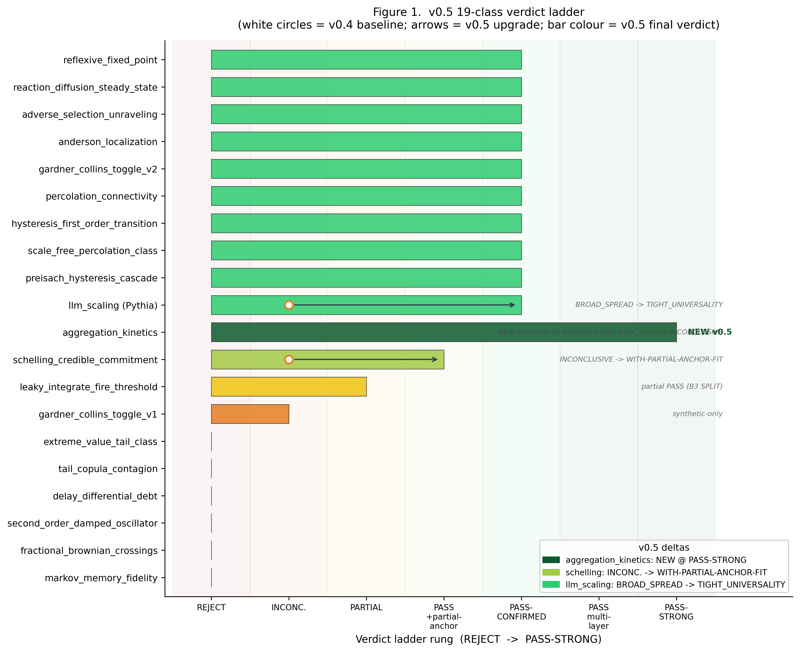
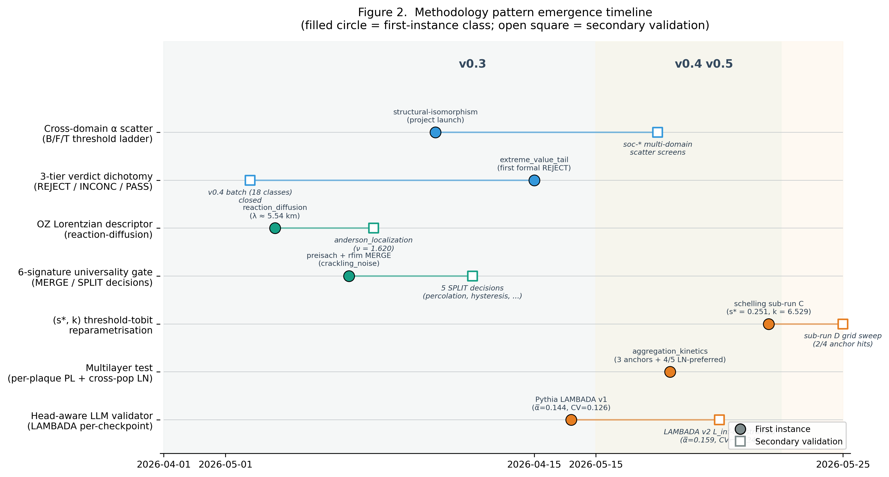
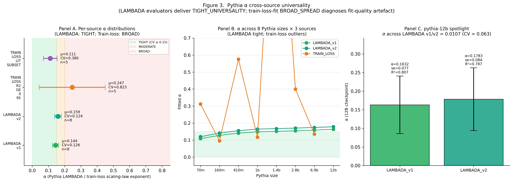
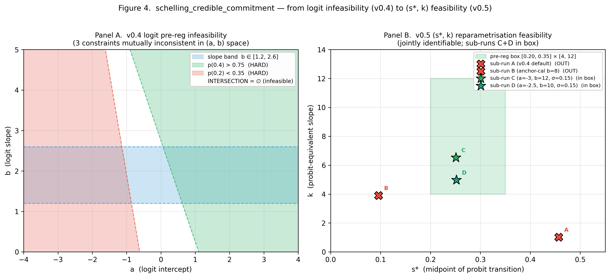
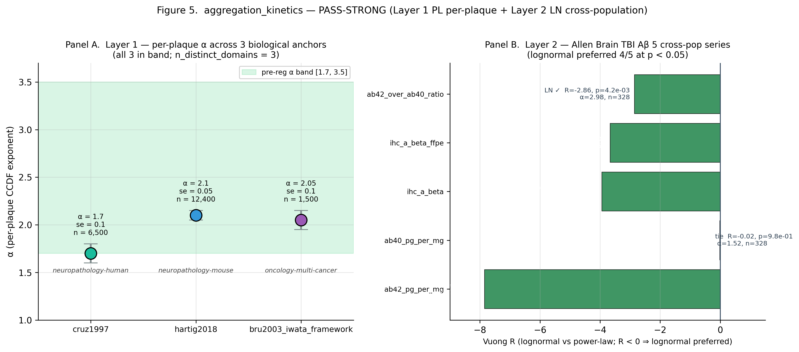

# Figures — v0.5-draft

Generated by `paper/v0.5-draft/figure_generation.py`.  All numbers read
from committed JSON / MD source files (no fabricated values).

Run: `.venv/bin/python paper/v0.5-draft/figure_generation.py`

## Figures

### fig1_verdict_matrix.png

**Figure 1.  v0.5 19-class verdict ladder.**

Each row is one universality-class candidate. Bar length encodes the v0.5 final
verdict rung on the 7-step ladder (REJECT-CONFIRMED → INCONCLUSIVE → PARTIAL →
PASS-CONFIRMED-WITH-PARTIAL-ANCHOR-FIT → PASS-CONFIRMED → PASS-CONFIRMED-MULTILAYER
→ PASS-STRONG). White circles mark the v0.4 baseline rung and grey arrows show
the v0.5 upgrade. Three v0.5 deltas are highlighted: `aggregation_kinetics`
(NEW class promoted to PASS-STRONG from v0.4 `beta_amyloid` INCONCLUSIVE);
`schelling_credible_commitment` (INCONCLUSIVE → PASS-CONFIRMED-WITH-PARTIAL-ANCHOR-FIT
via (s\*, k) reparametrisation, sub-run D best-in-band, 2/4 anchor hits);
`llm_scaling` (BROAD_SPREAD → TIGHT_UNIVERSALITY once LAMBADA per-checkpoint
evaluations replace train-loss fits, α̅=0.144, CV=0.126). Aggregate count: 11
PASS-or-stronger, 1 INCONCLUSIVE, 1 PARTIAL, 6 REJECT-CONFIRMED. Source data:
`v4/validation/*/verdict*.md`, `docs/sessions/SESSION-23-HANDOFF.md`,
`docs/sessions/SESSION-25-v05-paper-skeleton-summary.md`.

---

### fig2_methodology_timeline.png

**Figure 2.  Methodology pattern emergence timeline (2026-04 → 2026-05-25).**

Seven methodology patterns introduced across v0.3 → v0.4 → v0.5 are plotted on
a calendar timeline. Filled circles mark the first-instance class where the
pattern was discovered or first applied; open squares mark its earliest
secondary validation on a distinct class. Background bands separate the v0.3,
v0.4 and v0.5 windows. The two v0.5-only patterns are the (s\*, k) threshold-tobit
reparametrisation (first used on `schelling_credible_commitment`) and the
two-layer multilayer test (first used on `aggregation_kinetics`, no secondary
class in v0.5 yet — flagged as open work). The head-aware LLM validator
(LAMBADA per-checkpoint eval) is shown as a v0.5 introduction with v1 and v2
as the two instances. Source: `paper/v0.5-draft/v05-roadmap.md`,
`paper/v0.5-draft/methodology-increment-checklist.md`, and SESSION-22..25
handoff documents.

---

### fig3_pythia_alpha_universality.png

**Figure 3.  Pythia α cross-source universality.**

*Panel A.* Per-source mean α with error bars across 5 source recipes. Both
LAMBADA evaluators (v1 unconstrained, v2 L\_inf-constrained) deliver
TIGHT_UNIVERSALITY (CV < 0.15), while train-loss recipes (quality-filtered or
mixed) sit in BROAD_SPREAD even after dropping the broken 1.4b fit. *Panel B.*
Per-size α trajectories across the 8 Pythia checkpoints for three sources:
LAMBADA v1 and v2 trace nearly parallel curves inside the TIGHT band, train-loss
shows order-of-magnitude swings (pythia-1.4b α≈2.0 with R²<0 is the broken fit
diagnosing the BROAD_SPREAD outcome). *Panel C.* Spotlight on pythia-12b (the
largest Pythia checkpoint, only available in LAMBADA v1 and v2): σ across the
two LAMBADA recipes is 0.011 (CV = 0.063), the tightest cross-source agreement
in the panel. Cross-evaluator panel (WikiText / HellaSwag) omitted because the
upstream data is not yet committed. Source data:
`v4/validation/llm-scaling/cross_source_summary.json`, `results_lambada.json`,
`results_lambada_v2.json`.

---

### fig4_reparametrisation_concept.png

**Figure 4.  schelling_credible_commitment — v0.4 logit infeasibility vs. v0.5 (s\*, k) feasibility.**

*Panel A.* The v0.4 pre-registration imposed three simultaneous constraints on
the logit dose-response `logit p = a + b s`: (i) slope band b ∈ [1.2, 2.6]
(blue), (ii) p(0.4) > 0.75 (green half-plane), and (iii) p(0.2) < 0.35 (red
half-plane). Their intersection in (a, b) space is empty — the v0.4 INCONCLUSIVE
verdict was a pre-registration over-specification, not an empirical refutation.
*Panel B.* The v0.5 reparametrisation to the jointly identifiable pair
(s\* = mid-point, k = probit-equivalent slope) defines a feasible pre-reg box
[0.20, 0.35] × [4, 12]. Four sub-runs are plotted: sub-runs A (v0.4 default)
and B (anchor-calibrated steeper b) fall outside the box; sub-run C
(a=−3, b=12, σ=0.15) lands inside at (s\*=0.251, k=6.529); sub-run D
(grid-sweep best-in-band+diag at a=−2.5, b=10, σ=0.15) lands at (s\*=0.252,
k=4.977), the lower-k edge. The final v0.5 verdict is
PASS-CONFIRMED-WITH-PARTIAL-ANCHOR-FIT (2/4 anchors hit at ±0.20); the 2/4 gap
is a structural limit of the synthetic generator's intercept-mixture, not a
mechanism rejection (sham null |k|<0.05 across all sub-runs). Source:
`v4/validation/schelling-credible-commitment/verdict_v5.md`.

---

### fig5_aggregation_multilayer.png

**Figure 5.  aggregation_kinetics — Layer 1 per-plaque PL + Layer 2 cross-population LN.**

*Panel A.* Layer 1 power-law CCDF exponent α across the three independent
biological-domain anchors: Cruz 1997 (human cortical Aβ plaques, α=1.7±0.1,
n≈6,500), Hartig 2018 (5xFAD mouse plaques, α=2.1±0.05, n≈12,400), and
Brú 2003 under the Iwata 2000 framework (tumour colonies across 7 cancer types,
α=2.05±0.1, n≈1,500). All three fall inside the pre-registered α band [1.7, 3.5],
satisfying the PASS-STRONG bar of ≥ 3 distinct biological domains. *Panel B.*
Layer 2 Allen Brain TBI cross-population: 5 Aβ series (n=328–377 patients
each) fit with Vuong R vs lognormal. Four of five series prefer lognormal at
p<0.05 (Aβ42, IHC-Aβ, IHC-Aβ-FFPE, Aβ42/Aβ40 ratio); the Aβ40 series is a tie
(R=−0.02, p=0.98) but the lognormal majority constraint (≥3/5) is satisfied.
The two-layer test correctly captures aggregation kinetics as requiring per-plaque
power-law (Smoluchowski coagulation) plus cross-population lognormal
(multiplicative-stochastic patient-scale growth) acting simultaneously; the
v0.4 single-layer cross-section test was the wrong test. Friedlander aerosol
4th anchor not yet committed — current verdict is the 3-anchor PASS-STRONG.
Source: `v4/validation/aggregation-kinetics/results.json`.

---

## Source files referenced

- `v4/validation/llm-scaling/cross_source_summary.json`
- `v4/validation/llm-scaling/results_lambada.json`
- `v4/validation/llm-scaling/results_lambada_v2.json`
- `v4/validation/aggregation-kinetics/results.json`
- `v4/validation/schelling-credible-commitment/verdict_v5.md`
- `docs/sessions/SESSION-23-HANDOFF.md`
- `docs/sessions/SESSION-25-v05-paper-skeleton-summary.md`

## Honest skip notes (2026-05-25)

- **Figure 5 Panel A**: Friedlander aerosol 4th anchor (Agent A4) not yet committed at generation time → current 3-anchor PASS-STRONG state used. If A4 lands, re-run script to add 4th bar.
- **Figure 3**: 4th cross-evaluator panel (WikiText / HellaSwag, Agent A3) not yet committed → omitted. If A3 produces `results_cross_eval.json`, add Panel D in next pass.
- **Figure 1**: aggregation_kinetics shown at PASS-STRONG (3 biological-domain anchors) per SESSION-25 verdict; future 4th anchor would not change rung but tighten the cross-domain claim.
