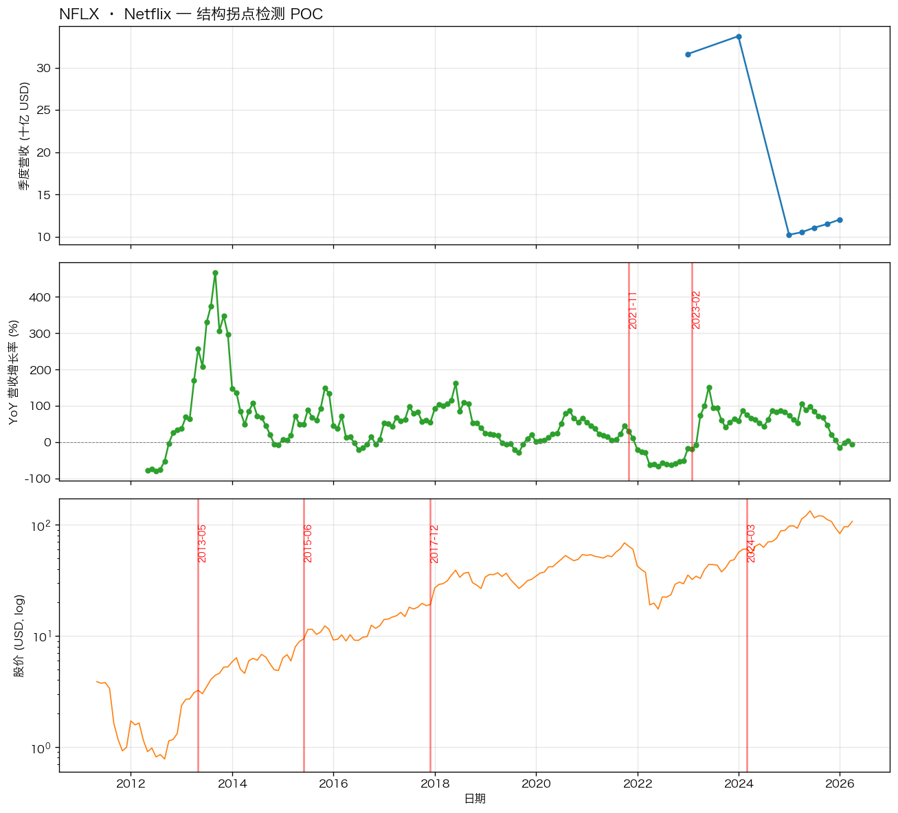
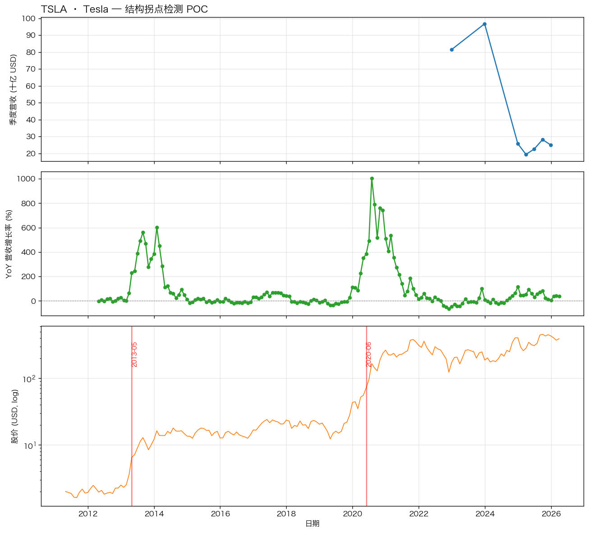
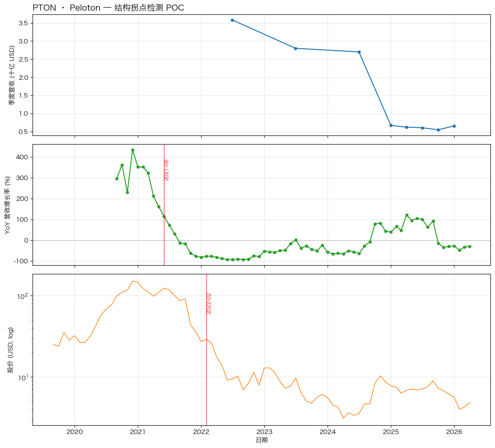
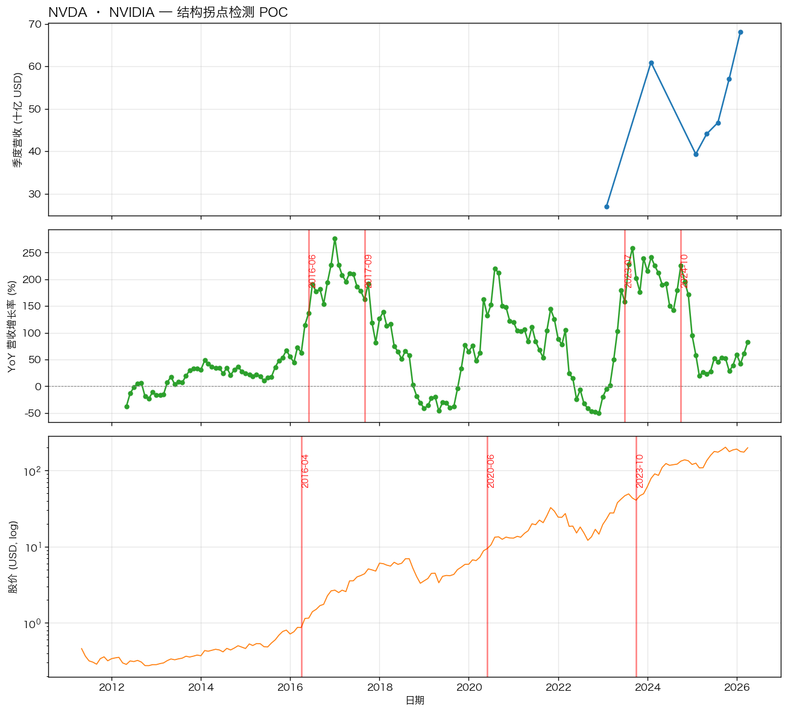
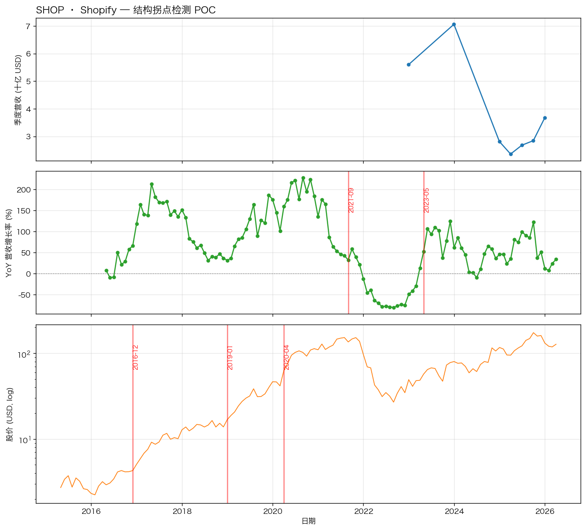
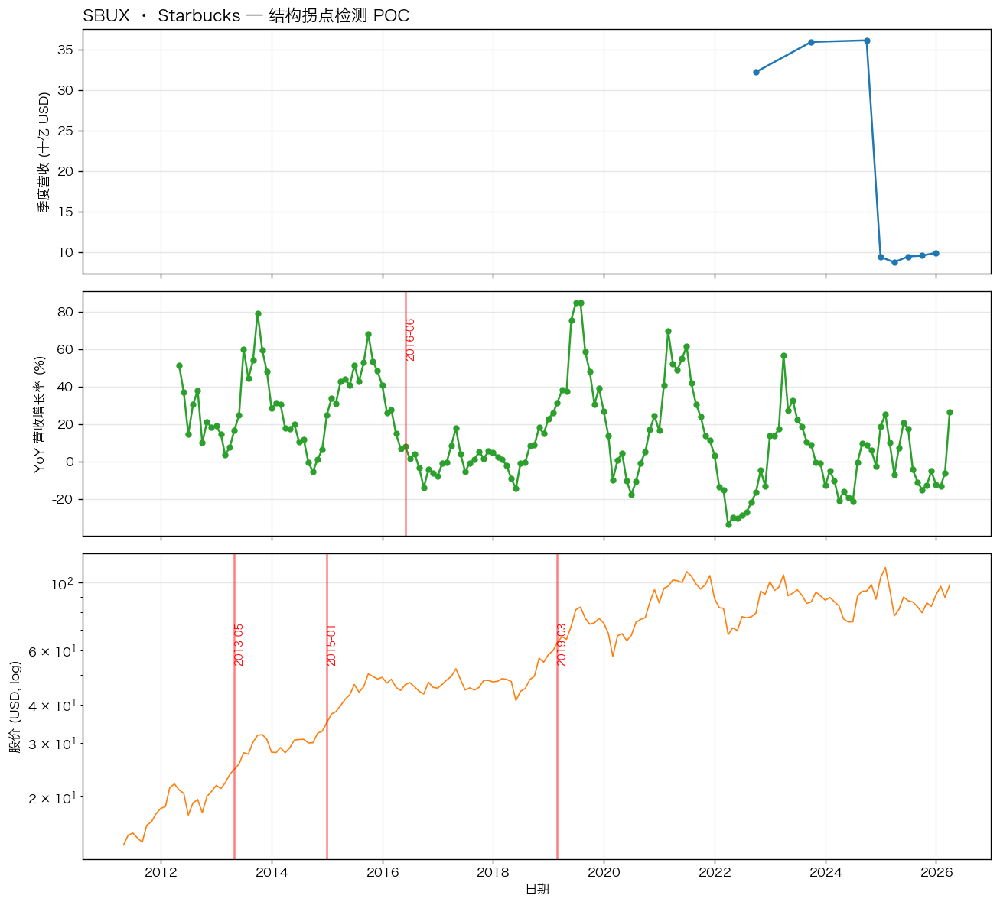
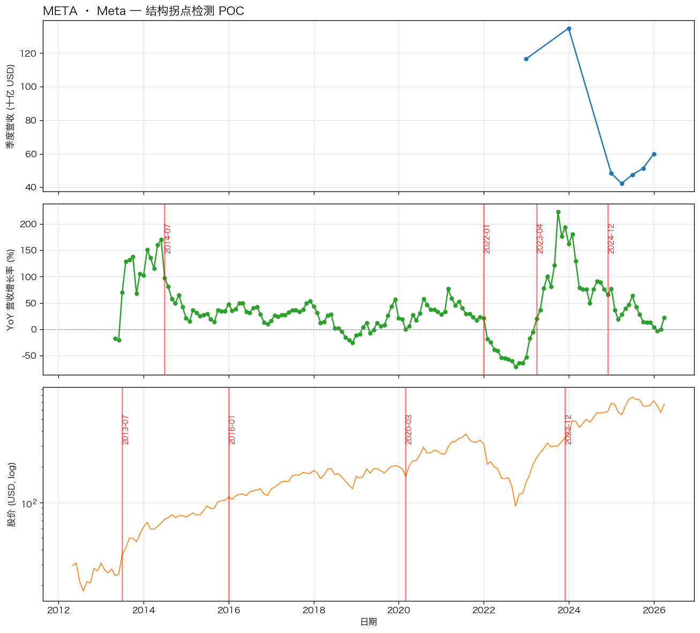

# PELT 结构拐点 POC — 中文结论
生成时间: 2026-04-16 13:33
## 方法
1. 从 yfinance 拉每家公司季度+年度营收
2. 算 YoY 同比营收增长率

## 🔬 关键验证：拐点真的有投资意义吗？

对所有找到的高置信度拐点，统计「拐点前 60 天」vs「拐点后 60 天」的股价表现：

- **总拐点数**：14
- **趋势反转（涨跌方向翻转）**：4/14 = 29%
- **有显著 regime 变化（趋势反转/波动率突增/趋势加速）**：7/14 = 50%
- **拐点前后累计收益差值中位数**：14.2 个百分点
- **拐点前后波动率比值中位数**：0.90x（>1 表示拐点后更不稳）

**⚠️ 信号弱可用**：30-50% 的拐点对应 regime change，需要进一步过滤。

---

3. 用 PELT（惩罚式线性时间算法，model=rbf）自动找「均值或方差明显变化」的拐点
4. 和「我们心里预期的拐点」对比（±1 年算命中）

## NFLX · Netflix
**业务描述**：从 DVD 租赁转流媒体 + 全球扩张后饱和
**信号源**：股价 YoY（营收数据不足时的代理）（168 个数据点）
**预期拐点**：
  - 2011: DVD/Qwikster 事件 + 流媒体转型
  - 2015: 全球扩张期启动，加速增长
  - 2022: 订阅用户负增长，饱和显现

**PELT 在 YoY 上找到的高置信度拐点**（Top 4，按置信度打分）：

| 拐点日期 | 置信度 | 前 60 天累计 | 后 60 天累计 | 前波动率 | 后波动率 | 判断 |
|---|---|---|---|---|---|---|
| 2021-11 | 4.85 | +17.3% | -10.1% | 1.7% | 1.7% | **趋势反转** |
| 2023-02 | 4.72 | +13.2% | -4.6% | 2.9% | 2.5% | **趋势反转** |

**PELT 在股价上找到的拐点**： 2013-05, 2015-06, 2017-12, 2024-03

**命中评分**：1/3 命中
  - 2022✓ 订阅用户负增长，饱和显现
  - 2011✗ DVD/Qwikster 事件 + 流媒体转型
  - 2015✗ 全球扩张期启动，加速增长

---

## TSLA · Tesla
**业务描述**：交付量从小众爆发到主流
**信号源**：股价 YoY（营收数据不足时的代理）（168 个数据点）
**预期拐点**：
  - 2018: Model 3 量产爬坡，交付拐点
  - 2021: 全球扩张进入超级增长

**PELT 在 YoY 上找到的高置信度拐点**（Top 4，按置信度打分）：

（未找到高置信度拐点）

**PELT 在股价上找到的拐点**： 2013-05, 2020-06

**命中评分**：0/2 命中
  - 2018✗ Model 3 量产爬坡，交付拐点
  - 2021✗ 全球扩张进入超级增长

---

## PTON · Peloton
**业务描述**：COVID 红利 + 崩塌
**信号源**：股价 YoY（营收数据不足时的代理）（68 个数据点）
**预期拐点**：
  - 2020: 疫情居家需求爆发
  - 2021: 疫情消退需求崩塌

**PELT 在 YoY 上找到的高置信度拐点**（Top 4，按置信度打分）：

| 拐点日期 | 置信度 | 前 60 天累计 | 后 60 天累计 | 前波动率 | 后波动率 | 判断 |
|---|---|---|---|---|---|---|
| 2021-06 | 7.60 | +1.1% | +8.4% | 4.4% | 3.4% | **无明显变化** |

**PELT 在股价上找到的拐点**： 2022-02

**命中评分**：2/2 命中
  - 2020✓ 疫情居家需求爆发
  - 2021✓ 疫情消退需求崩塌

---

## NVDA · NVIDIA
**业务描述**：从游戏显卡转数据中心/AI
**信号源**：股价 YoY（营收数据不足时的代理）（168 个数据点）
**预期拐点**：
  - 2016: 数据中心业务起飞
  - 2018: 挖矿泡沫 + 破裂
  - 2023: AI 需求大爆发

**PELT 在 YoY 上找到的高置信度拐点**（Top 4，按置信度打分）：

| 拐点日期 | 置信度 | 前 60 天累计 | 后 60 天累计 | 前波动率 | 后波动率 | 判断 |
|---|---|---|---|---|---|---|
| 2016-06 | 8.27 | +30.8% | +22.0% | 2.7% | 1.7% | **无明显变化** |
| 2017-09 | 6.48 | +21.7% | +19.6% | 2.3% | 1.9% | **无明显变化** |
| 2023-07 | 6.66 | +50.0% | +15.0% | 4.5% | 2.8% | **趋势减速** |
| 2024-10 | 6.14 | +13.2% | +18.2% | 3.8% | 2.4% | **无明显变化** |

**PELT 在股价上找到的拐点**： 2016-04, 2020-06, 2023-10

**命中评分**：3/3 命中
  - 2016✓ 数据中心业务起飞
  - 2018✓ 挖矿泡沫 + 破裂
  - 2023✓ AI 需求大爆发

---

## SHOP · Shopify
**业务描述**：电商 SaaS 从小卖家到企业级
**信号源**：股价 YoY（营收数据不足时的代理）（120 个数据点）
**预期拐点**：
  - 2020: COVID 电商大爆发
  - 2022: 需求正常化后回调

**PELT 在 YoY 上找到的高置信度拐点**（Top 4，按置信度打分）：

| 拐点日期 | 置信度 | 前 60 天累计 | 后 60 天累计 | 前波动率 | 后波动率 | 判断 |
|---|---|---|---|---|---|---|
| 2021-09 | 8.72 | -0.9% | -4.7% | 2.0% | 2.4% | **无明显变化** |
| 2023-05 | 5.50 | +17.7% | +34.9% | 2.5% | 4.7% | **波动率突增** |

**PELT 在股价上找到的拐点**： 2016-12, 2019-01, 2020-04

**命中评分**：2/2 命中
  - 2020✓ COVID 电商大爆发
  - 2022✓ 需求正常化后回调

---

## SBUX · Starbucks
**业务描述**：成熟连锁，理论上不该有明显结构断点
**信号源**：股价 YoY（营收数据不足时的代理）（168 个数据点）
**预期拐点**：
  - —: 预期不应该有强信号（对照组）

**PELT 在 YoY 上找到的高置信度拐点**（Top 4，按置信度打分）：

| 拐点日期 | 置信度 | 前 60 天累计 | 后 60 天累计 | 前波动率 | 后波动率 | 判断 |
|---|---|---|---|---|---|---|
| 2016-06 | 5.97 | -8.6% | +5.9% | 1.2% | 1.1% | **趋势反转** |

**PELT 在股价上找到的拐点**： 2013-05, 2015-01, 2019-03

**命中评分**：对照组
  - 检出 1 个拐点（期望 ≤1 个才算好）

---

## META · Meta
**业务描述**：Facebook 主站饱和 + 广告生意成熟
**信号源**：股价 YoY（营收数据不足时的代理）（156 个数据点）
**预期拐点**：
  - 2018: DAU 在美国/加拿大饱和
  - 2022: 用户流向 TikTok 流失期

**PELT 在 YoY 上找到的高置信度拐点**（Top 4，按置信度打分）：

| 拐点日期 | 置信度 | 前 60 天累计 | 后 60 天累计 | 前波动率 | 后波动率 | 判断 |
|---|---|---|---|---|---|---|
| 2014-07 | 5.38 | +11.3% | +9.9% | 1.8% | 1.8% | **无明显变化** |
| 2022-01 | 5.15 | +2.5% | -39.9% | 2.0% | 4.9% | **趋势反转** |
| 2023-04 | 10.96 | +42.3% | +23.2% | 4.3% | 2.6% | **趋势减速** |
| 2024-12 | 6.06 | +0.3% | +14.2% | 1.6% | 1.8% | **无明显变化** |

**PELT 在股价上找到的拐点**： 2013-07, 2016-01, 2020-03, 2023-12

**命中评分**：1/2 命中
  - 2022✓ 用户流向 TikTok 流失期
  - 2018✗ DAU 在美国/加拿大饱和

---

