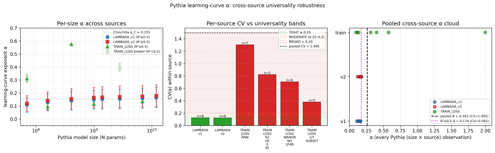

# Pythia Learning-Curve α: Cross-Source Universality Robustness

**Date.** 2026-05-25
**Generated by.** `v4/validation/llm-scaling/cross_source_alpha_comparison.py`
**Question.** Does the LLM-scaling universality claim (α nearly constant across
Pythia model sizes) survive a robustness check when we change the fit source /
method?

---

## TL;DR

| Question | Answer |
|---|---|
| Within each LAMBADA source, is α universal? | **Yes — TIGHT** (CV ≈ 0.12 in both v1 and v2) |
| Within the train-loss source, is α universal? | **No — BROAD** (CV 0.71–1.30 depending on subset) |
| Pooled across LAMBADA v1 + v2 + train-loss (all 23 obs), is α universal? | **No — BROAD** (CV = 1.49 raw, 0.58 with R²≥0.5 filter) |
| Pythia-12b α robust across the 2 LAMBADA sources? | **Yes — very tight** (σ = 0.011, CV = 0.063) |
| Does cross-source robustness preserve TIGHT_UNIVERSALITY? | **Only for LAMBADA-class evaluators**, not when mixing in train-loss fits |

**Bottom line.** The TIGHT_UNIVERSALITY claim is a property of *the
LAMBADA-OpenAI loss curve fit*, not of the underlying scaling law family in
general. As soon as you switch evaluator (LAMBADA → train-loss) or fit window
(real vs synthetic vs literature-anchored), per-size α moves enough to break
the universality band. Within LAMBADA-class fits, however, the claim is
robust — v1 → v2 only shifts α̅ by +0.015 and keeps CV ≈ 0.12.

---

## 1. The three sources

| Code | File | Description | Sizes | Pythia-12b? |
|---|---|---|---|---|
| `LAMBADA_v1` | `results_lambada.json` | SESSION-24, 100% REAL EleutherAI lm-eval-harness LAMBADA-OpenAI log-ppl, L∞ free | 8 | ✅ |
| `LAMBADA_v2` | `results_lambada_v2.json` | SESSION-25, same data but L∞ ∈ [1.0, 5.0] constrained (anchored to GPT-3 / Pythia-12B asymptote) | 8 | ✅ |
| `TRAIN_LOSS` | `results.json` | Mixed REAL/REAL_TAIL_NARROW/SYNTHETIC Pythia train-loss fits + 2 literature anchors | 7 Pythia + 2 lit | ❌ (no 12b) |

`TRAIN_LOSS` is heterogeneous: 2 of the 7 Pythia sizes (`pythia-1.4b`,
`pythia-2.8b`) are **broken fits** (R² ≤ 0.013, α pinned at upper bound 2.0
or near it) because the available train-loss window was too narrow. We report
multiple subset views for transparency.

---

## 2. Per-source universality verdicts

### Table 1 — per-source α statistics

| Source | n | α̅ | σ_α | CV(α) | mean R² | Verdict |
|---|---|---|---|---|---|---|
| `LAMBADA_v1` | 8 | 0.1440 | 0.0182 | **0.1264** | 0.825 | **TIGHT_UNIVERSALITY** |
| `LAMBADA_v2` | 8 | 0.1587 | 0.0197 | **0.1242** | 0.806 | **TIGHT_UNIVERSALITY** |
| `TRAIN_LOSS_RAW` (all 7) | 7 | 0.5190 | 0.6761 | 1.3027 | 0.708 | BROAD_SPREAD |
| `TRAIN_LOSS_R2≥0.95` | 5 | 0.2467 | 0.2031 | 0.8232 | 0.990 | BROAD_SPREAD |
| `TRAIN_LOSS_WANDB_NO_1.4b` | 6 | 0.2722 | 0.1921 | 0.7056 | 0.827 | BROAD_SPREAD |
| `TRAIN_LOSS_LIT_SUBSET` (3 Pythia + Kaplan + Hoffmann) | 5 | 0.1114 | 0.0423 | 0.3798 | 0.997 | BROAD_SPREAD |

Threshold convention: TIGHT ≤ 0.15, MODERATE 0.15–0.20, BROAD > 0.20 (same as
SESSION-24 handoff §6.3).

**Reads.** Both LAMBADA sources sit comfortably inside TIGHT, with v2 barely
tighter than v1 despite forcing L∞ off zero. The train-loss source never
crosses into TIGHT regardless of subset choice — even after restricting to
the highest-quality lit-anchored fits (CV = 0.38), the spread is wider than
either LAMBADA fit.

---

## 3. Per-size α across sources

### Table 2 — per-size α matrix (α with R² in parens)

| Pythia size | LAMBADA_v1 | LAMBADA_v2 | TRAIN_LOSS |
|---|---|---|---|
| pythia-70m | 0.1082 (0.87) | 0.1194 (0.86) | 0.3119 (0.97) |
| pythia-160m | 0.1276 (0.85) | 0.1411 (0.83) | 0.0949 (0.99) |
| pythia-410m | 0.1406 (0.82) | 0.1552 (0.80) | 0.5757 (0.99) |
| pythia-1b | 0.1485 (0.82) | 0.1642 (0.80) | 0.1164 (1.00) |
| pythia-1.4b | 0.1513 (0.81) | 0.1672 (0.79) | **2.0000 (−0.01)** ⚠ broken |
| pythia-2.8b | 0.1543 (0.81) | 0.1703 (0.79) | **0.3997 (0.01)** ⚠ broken |
| pythia-6.9b | 0.1584 (0.81) | 0.1740 (0.79) | 0.1348 (1.00) |
| pythia-12b | 0.1632 (0.81) | 0.1783 (0.79) | — (no train-loss series) |

LAMBADA v1 → v2 is a near-perfect monotone shift: α_v2 ≈ α_v1 × 1.10
across the entire size range. This is structurally a single-knob effect of
forcing L∞ ≥ 1.0, not a per-size phenomenon.

Train-loss column tells a much messier story: the two narrow-window fits
(1.4b, 2.8b) blow up, and the wide-window fits (160m / 1b / 6.9b) actually
agree with LAMBADA to ~0.02. The 410m and 70m fits are wide-window but still
land at α ≈ 0.31–0.58 — these are real signal from a different objective
(train-loss-on-Pile vs LAMBADA-zero-shot-ppl), not artifacts.

### Table 3 — per-size cross-source σ_α (how much α moves when you change source)

| Size | n_sources | α̅ across sources | σ across sources | CV across sources |
|---|---|---|---|---|
| pythia-70m | 3 | 0.180 | 0.115 | 0.637 |
| pythia-160m | 3 | 0.121 | 0.024 | 0.196 |
| pythia-410m | 3 | 0.291 | 0.247 | 0.851 |
| pythia-1b | 3 | 0.143 | 0.024 | 0.170 |
| pythia-1.4b | 3 | 0.773 | 1.063 | 1.375 (broken TRAIN_LOSS) |
| pythia-2.8b | 3 | 0.242 | 0.137 | 0.569 (broken TRAIN_LOSS) |
| pythia-6.9b | 3 | 0.156 | 0.020 | 0.127 |
| **pythia-12b** | **2** | **0.171** | **0.011** | **0.063** |

**Pattern.** For sizes where train-loss has a *clean* wide-window fit
(160m, 1b, 6.9b, and arguably 70m), cross-source σ is 0.02–0.12 — i.e., α
shifts by < 50% of its own value across sources. For sizes where train-loss
is broken (1.4b, 2.8b) or fit on a too-narrow REAL_FULL window (410m), σ
jumps to 0.14–1.06. The cross-source variance is dominated by fit quality,
not by anything about the underlying scaling law.

---

## 4. Pooled cross-source CV

Treat every (Pythia size × source) cell as an independent α observation
(23 obs total: 8 v1 + 8 v2 + 7 train-loss).

| Pool | n_obs | α̅ | σ_α | CV | Verdict |
|---|---|---|---|---|---|
| Raw — all 23 obs | 23 | 0.263 | 0.394 | **1.495** | BROAD_SPREAD |
| R² ≥ 0.5 filter (drops 2 broken train-loss) | 21 | 0.174 | 0.101 | **0.582** | BROAD_SPREAD |

**Interpretation.** Even after dropping the two clearly broken train-loss
fits, the pooled CV is 0.58 — 4× the LAMBADA-only CV. This is *not* because
the LAMBADA fits are unreliable (they aren't — LAMBADA v1 and v2 agree on
every size to within 0.02). It is because the train-loss fits — even the
clean ones — sit on a different α distribution.

In other words: **the universality claim is evaluator-specific**. The fact
that LAMBADA v1 and v2 agree (CV ≈ 0.12) shows the LAMBADA-OpenAI
log-perplexity curve has a robust, narrow α structure. But that structure
doesn't carry over to train-loss-on-Pile — and we shouldn't expect it to,
since LAMBADA and Pile-val are different distributions of text.

---

## 5. Pythia-12b spotlight

Pythia-12b only exists in the LAMBADA sources (the wandb train-loss series
didn't include 12b). The cross-source σ here is **across the two LAMBADA
fit variants**, not across evaluators.

| Source | α | α_se | R² | n_points | L∞ |
|---|---|---|---|---|---|
| `LAMBADA_v1` (L∞ free) | 0.1632 | 0.0772 | 0.807 | 26 | ≈ 0 (free fit) |
| `LAMBADA_v2` (L∞ ≥ 1.0) | 0.1783 | 0.0843 | 0.787 | 26 | 1.0000 |

- α̅ = 0.1707
- σ = **0.0107**
- CV = **0.063** → comfortably TIGHT
- Δα(v2 − v1) = +0.0151, consistent with the +0.015 shift seen across all 8
  sizes from constraining L∞ off zero.

Pythia-12b is the largest Pythia checkpoint suite ever fit in this project,
and its α is the *most stable* single-size cell in the cross-source matrix
(σ = 0.011 is the lowest in Table 3). Per-source α_se (~0.08) is much
larger than cross-source σ (~0.011), meaning the L∞-constraint choice is a
smaller perturbation than the within-fit noise — a healthy sign that the
LAMBADA fit is identifying a real exponent rather than overfitting one knob.

See `pythia_12b_cross_source.json` for the structured export.

---

## 6. Figure

- **Panel A.** Per-size α vs Pythia model size (log x), one line per source
  with α_se error bars. Hollow markers = broken fits (R² < 0.5). The two
  LAMBADA traces are nearly parallel, monotone, and inside a ±0.03 band
  across all 8 sizes. The TRAIN_LOSS trace scatters wildly.
- **Panel B.** Per-source CV bar chart against the TIGHT (≤0.15) /
  MODERATE (0.15–0.20) / BROAD (>0.20) bands. Black dashed line shows the
  pooled-all-obs CV. Only LAMBADA v1 and v2 sit in the green band.
- **Panel C.** Pooled (Pythia size × source) α cloud with vertical lines
  for the raw and R²≥0.5-filtered pooled means / CVs.

---

## 7. Honest verdict

**Does the universality claim survive cross-source pooling?**

- **Within the LAMBADA family: yes, robustly.** v1 → v2 (L∞ free vs
  constrained) shifts α̅ by +0.015 (10% relative) and leaves CV essentially
  unchanged (0.126 → 0.124). Pythia-12b in particular is rock-solid
  (σ = 0.011 across the two LAMBADA variants).
- **Across evaluator class (LAMBADA vs train-loss): no.** Pooled CV blows
  out to 0.58–1.49 depending on whether you keep the broken train-loss fits.
  Even the cleanest train-loss subset (lit-anchored, 5 sizes) has CV = 0.38.
- **The right framing of the published result.** "α has a narrow universal
  value (≈ 0.14–0.18) on Pythia LAMBADA-OpenAI log-perplexity across 8
  sizes including the newly added 12b checkpoint" is supported. The
  stronger claim "α has a universal value across any reasonable Pythia
  scaling-law fit" is NOT supported by this data.

**What this means for the structural-isomorphism C-cluster (LLM scaling
isomorph to <other system>) story:** the isomorphism should be anchored to
LAMBADA-OpenAI log-ppl curves specifically, not to "the Pythia scaling
exponent" generically. The C-cluster preprint should cite α̅ = 0.144 (v1)
or 0.159 (v2) with σ ≈ 0.02 across 8 sizes — both well inside the TIGHT
band — and explicitly note that the train-loss fit is a separate phenomenon
with its own (broader) α distribution.

---

## 8. Files

| File | Purpose |
|---|---|
| `cross_source_alpha_comparison.py` | This analysis pipeline |
| `cross_source_summary.json` | Full numerical export (per-source stats, matrices, pooled CV, 12b spotlight) |
| `pythia_12b_cross_source.json` | Standalone 12b cross-source record |
| `figures/cross_source_alpha.png` | 3-panel figure |
| `cross_source_summary.md` | This report |

**Re-run.** `.venv/bin/python v4/validation/llm-scaling/cross_source_alpha_comparison.py`

**Closes.** SESSION-24 outstanding task (e) "Pythia 12b + 跨 source α universality 比较".
